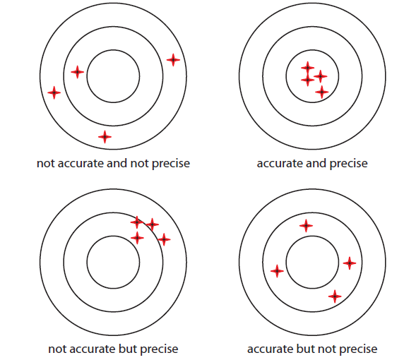
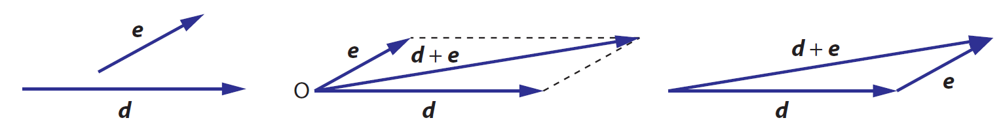
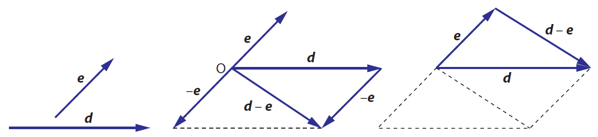
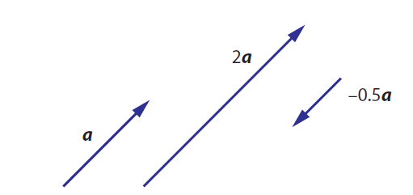
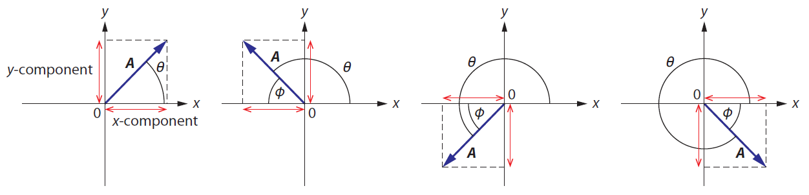

# Đo lường và Sai số

## Đại lượng trong vật lý

### Đại lượng và đơn vị

Đại lượng vật lý là những thứ có thể đo lường được, chẳng hạn như khối lượng, độ dài, thời gian, cường độ dòng điện. Có thể chia đại lượng làm hai loại:

- Đại lượng cơ bản:
- Đại lượng dẫn xuất:

### Đơn vị cơ bản và Đơn vị dẫn xuất

Đối với các đại lượng cơ bản, hệ đơn vị đo lường quốc tế (SI) sử dụng 7 đơn vị đo lường cơ bản:

1. Mét (m): khoảng cách ánh sáng di chuyển được trong chân không trong thời gian $\frac{1}{299 792 458}$ giây.
2. Kilogram (kg): khối lượng của khối kilogram chuẩn quốc tế được Văn phòng Cân đo Quốc tế (BIPM) lưu giữ.
3. Giây (s): khoảng thời gian bằng 9 192 631 770 lần chu kỳ của bức xạ điện từ phát ra bởi nguyên tử Caesium-133.
4. Ampere (A):
5. Kelvin (K)
6. Mole (mol)
7. Candela (cd)

Đối với các đại lượng còn lại (đại lượng dẫn xuất), đơn vị đo được rút ra từ các đơn vị cơ bản thông qua các công thức tính. Ví dụ, đơn vị đo áp suất, (Pa) bằng m^-1 kg s^-2.

### Số có nghĩa

Số có nghĩa là các chữ số quan trọng mang lại thông tin trong một kết quả hoặc số đo.

Các quy tắc xác định số có nghĩa:

1. Các chữ số khác không luôn có nghĩa. Ví dụ, số 345 có 3 chữ số có nghĩa (3 s.f)
2. Số 0 nằm giữa các số khác 0 cũng là số có nghĩa. Ví dụ, số 3405 có 4 chữ số có nghĩa (4 s.f)
3. Số 0 nằm ngoài cùng bên trái thì không có nghĩa. Ví dụ, 0.345 (3 s.f), 0.034 (2 s.f)
4. Số 0 nằm sau dấu thập phân và được viết sau một số khác 0 thì có nghĩa. Ví dụ, 1.034 (4 s.f); 1.00 (3 s.f); 0.34500 (5 s.f); 0.003 (1 s.f)
5. Dãy số 0 ở đuôi không có nghĩa, trừ khi được viết cùng dấu thập phân. Ví dụ, 400 (1 s.f); 400. (3 s.f)

### Ký hiệu khoa học

Ký hiệu khoa học là cách viết một số dưới dạng $a \times 10^b$ với $a$ là một số thực, $1 \leq a \leq 10$, và $b$ là số nguyên âm hoặc dương. Số chữ số xuất hiện trong $a$ là số chữ số có nghĩa của nó.

<!-- Viết lại câu này cho rõ ý hơn -->

Khi nhân hoặc chia hai số, số chữ số có nghĩa trong kết quả phải bằng với số chữ số có nghĩa ít nhất trong phép tính. Ví dụ

$$
\begin{aligned}
  & 23 \times 578= 13 294 \approx  1.3 \times 10^4 \\
  & \frac{6.244}{1.25} = 4.9952\ldots \approx 5.00
\end{aligned}
$$

## Sai số

Các sai số khi đo lường một đại lượng gồm hai nhóm chính: sai số hệ thống, và sai số ngẫu nhiên

- Sai số hệ thống (systematic error) là những sai lệch trong đo lường theo cùng một hướng: đều lớn, hoặc đều nhỏ. Sai số hệ thống có thể là kết quả của kỹ thuật đo lường.
- Sai số ngẫu nhiên (random uncertainty) xảy ra khi các kết quả đo lường có giá trị biến động: đôi khi lớn, đôi khi nhỏ. Không như sai số hệ thống, sai số ngẫu nhiên không lệch theo một hướng nhất định. 

### Accuracy và Precision

Một phép đo được gọi là accurate if sai số hệ thống nhỏ, nghĩa là các kết quả đo được gần với giá trị đúng của đại lượng. Một phép đo được gọi là precise nếu nó có sai số ngẫu nhiên nhỏ, nghĩa là các kết quả đo được gần bằng nhau.

{width=60% fig-align="center"}

### Tính toán sai số

Nếu $a = a_0 \pm \Delta a$:

- Sai số tuyệt đối $= \Delta a$
- Sai số tương đối $\delta a = \frac{\Delta a}{a_0}$
- Sai số phần trăm $= \frac{\Delta a}{a_0} \times 100\%$

Để xác định sai số trong kết quả của một đại lượng được tính từ các đại lượng khác. Ta sử dụng các quy tắc sau:

**Quy tắc cộng trừ**: Nếu $Q = a + b$ hoặc $Q = a - b$ hoặc $Q = a + b - c$ thì sai số tuyệt đối của $Q$ bằng tổng các sai số tuyệt đối của các đại lượng thành phần.

$$
\begin{aligned}
    &Q = a + b &\implies & \Delta Q = \Delta a + \Delta b \\
    &Q = a - b &\implies & \Delta Q = \Delta a + \Delta b \\
    &Q = a + b - c &\implies & \Delta Q = \Delta a + \Delta b + \Delta c
\end{aligned}
$$

**Quy tắc nhân chia**: Nếu $Q = ab$ hoặc $Q = \frac{a}{b}$ thì sai số tương đối của $Q$ bằng tổng các sai số tương đối của các đại lượng thành phần.

$$
  \begin{align}
    & Q = ab &\implies & \delta Q = \delta a + \delta b \\
    & Q = \frac{a}{b} &\implies  & \delta Q = \delta a + \delta b \\
    & Q = \frac{ab}{c} &\implies  & \delta Q = \delta a + \delta b + \delta c
  \end{align}
$$

**Quy tắc mũ và căn thức**: Sai số tương đối của kết quả bằng sai số tương đối của các đại lượng thành phần nhân với giá trị tuyệt đối của số mũ tương ứng.

$$
  \begin{align}
    Q = a^{n} &\implies \delta Q = \vert n \vert \delta a \\
    Q = \sqrt[n]{a} &\implies \delta Q = \lvert \frac{1}{n} \rvert \delta a
  \end{align}
$$

## Đại lượng có hướng (vector) và đại lượng vô hướng (scalar)

Các đại lượng được xác định hoàn toàn bởi độ lớn (như thời gian, khoảng cách, khối lượng, tốc độ, nhiệt độ) được gọi là các đại lượng vô hướng (scalar). Ngược lại, các đại lượng vừa có độ lớn vừa có hướng được gọi là các đại lượng có hướng (vector).

| Vector         | Scalar                |
| -------------- | --------------------- |
| Độ dịch chuyển | Khoảng cách           |
| vận tốc        | Tốc độ                |
| Trọng lượng    | Khối lượng            |
| Gia tốc        | Thời gian             |
| Lực            | Mật độ                |
| Điện trường    | Điện thế              |
| Từ trường      | Điện tích             |
| Trọng trường   | Thế năng trọng trường |
| Quán tính      | Nhiệt độ              |
| Diện tích      | Thể tích              |
| Vận tốc góc    | Công                  |

Một vector được biểu diễn bằng một mũi tên. Hướng của mũi tên thể hiện hướng của vector. Độ dài của mũi tên thể hiện độ lớn của nó.

Hai vector được gọi là bằng nhau nếu chúng có cùng hướng và cùng độ dài.

### Phép toán với vector

**Phép cộng vector**. Để cộng 2 vector, ta áp dụng quy tắc tam giác hoặc quy tắc hình bình hành.

**Phép trừ vector**. Để tính hiệu 2 vector $d - e$, ta lấy vector $d$ cộng với vector đối của vector $e$.

**Phép nhân vector với một số**. Khi nhân vector $a$ với một số $k$, ta được một vector mới, ký hiệu là $ka$, có độ dài gấp $\vert k \vert$ lần vector $a$ và hướng phụ thuộc vào dấu của $k$. Nếu $k > 0$, vector mới cùng hướng với vector $a$, nếu $k < 0$, vector mới ngược hướng với vector $a$.

{fig-align="center" width=50%}

### Phân tích vector

Cho vector $A$ trong hệ trục tọa độ Oxy, thành phần theo trục $x$ và trục $y$ của $A$ được gọi là $A_x, A_y$, được tính bằng

$$
  \begin{align}
    A_x = A \cos \theta \\
    A_y = A \sin \theta
  \end{align}
$$

với $\theta$ là góc tạo bởi vector và chiều dương của trục $Ox$.

### Dựng lại vector dựa trên các thành phần của nó
Giả sử ta có các thành phần theo trục $Ox$ và $Oy$ của một vector $A$ là $A_x$ và $A_y$. Để tính độ dài và góc $\theta $ tạo bởi $A$ và trục $Ox$, ta làm như sau:
$$
  A = \sqrt{A_x ^2 + A_y ^2} 
$$
và hướng của vector là
$$
  \tan \theta = \frac{A_y}{A_x}
$$

Ví dụ: Cho vector $A$ có độ dài bằng 8.0 đơn vị, vector $B$ có độ dài bằng 12 đơn vị. Hướng của của chúng được thể hiện như hình vẽ.

Các vector thành phần của $A$ và $B$ là:
$$
  \begin{align}
    A_x &= A \cos 30^\circ  = 6.928 \\
    A_y &= A \sin 30^\circ  = 4 \\
    \\  
    B_x &= B\cos 80^\circ = 2.084 \\
    B_y &= B\sin 80^\circ = 11.818
  \end{align}
$$
Vector tổng $C = A + B$ có thành phần như sau:
$$
  \begin{align}
    C_x &= A_x + B_x = 9.012 \\
    C_y &= A_y + B_y = 15.818
  \end{align}
$$
Độ dài của vector $C$ là
$$
  C = \sqrt{C_x ^2 + C_y ^2} = 18.205
$$
và hướng của nó là
$$
  \begin{align}
    \tan \theta &= \frac{C_y}{C_x} = \frac{15.818}{9.012} \\
    \theta &\thickapprox  60.3^\circ 
  \end{align}
$$

## Bài tập
**Bài 1.** Bài tập 4.1, 4.4, 4.11, 4.12, 4.21 sách bài tập Toán lớp 10 - KNTT.

**Bài 2.** Một vector vận tốc có độ lớn 1.2 m/s hướng theo phương ngang. Một vector vận tốc khác có độ lớn 2.0 m/s. Biết tổng hai vector trên hướng lên theo phương thẳng đứng. Tìm độ lớn và hướng của vector vận tốc thứ 2.

**Bài 3.** Một người đi bộ 5.0 km về hướng Đông, sau đó đi 3.0 km theo hướng Bắc và đi tiếp 4.0 km theo hướng Đông. Xác định vị trí cuối cùng của người đó (so với vị trí ban đầu).

**Bài 4.** Một vật chuyển động theo quỹ đạo tròn có bán kính 3.0 m với vận tốc không đổi là 6.0 m/s. Vector vận tốc tại mọi thời điểm luôn nằm trên đường tiếp tuyến của quỹ đạo tròn. Vật đó xuất phát ở A (vị trí 12h), đi qua B (vị trí 3h) và đến C (vị trí 6h). Xác định sự thay đổi vector vận tốc giữa A và B, và giữa B và C.

**Bài 5.** Xác định các thành phần của vector W theo các trục thể hiện trong hình vẽ.

**Bài 6.** Trong mỗi hình sau, xác định thành phần của vector theo các trục tọa độ. Biết mỗi vector có độ dài 10.0 đơn vị.

**Bài 7.** Xác định độ lớn và hướng của vector với thành phần cho như sau:

1. $A_x = -4.0$ cm, $A_y = -4.0$ cm.
2. $A_x = 124$ km, $A_y = -158$ km.
3. $A_x = 0$, $A_y = -5.0$ m.
4. $A_x = 8.0$ N, $A_y = 0$.

**Bài 8.** Cho vector $A$ có độ lớn bằng 12.0 đơn vị, tạo với chiều dương của trục $Ox$ một góc $30^\circ$. Vector $B$ có độ lớn bằng 8.0 đơn vị và tạo với chiều dương của trục $Ox$ một góc $80^\circ$. Xác định

1. $A + B$
2. $A - B$ 
3. $A - 2B$

**Bài 9.** Cho các thành phần của vector $A$ và $B$ như sau: $A_x = 2.00, A_y = 3.00, B_x = -2.00, B_y = 5.00$. Tìm độ lớn và hướng của vector sau

1. $A$
2. $B$
3. $A + B$
4. $A - B$
5. $2A - B$

**Bài 10.** Cho hai vector có độ lớn và góc như sau (góc được tính từ chiều dương của Ox theo ngược chiều kim đồng hồ), xác định độ lớn và hướng của vector tổng

1. $12.0$ N với góc $20^\circ$, và $14.0$ N với góc $50^\circ$.
2. $15.0$ N với góc $15^\circ$, và $18.0$ N với góc $105^\circ$.
3. $20.0$ N với góc $40^\circ$, và $15.0$ N với góc $310^\circ$.

