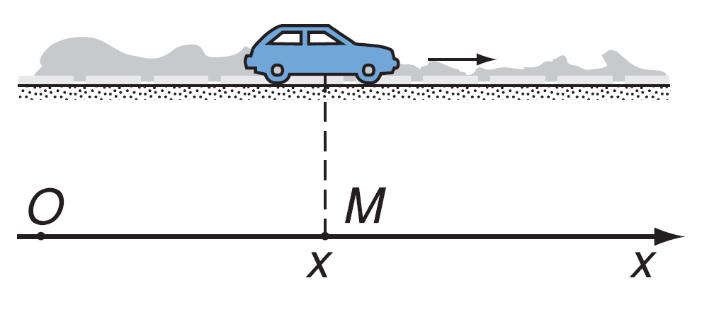
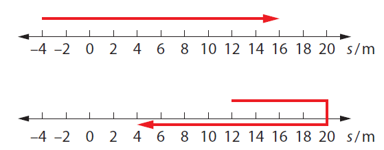
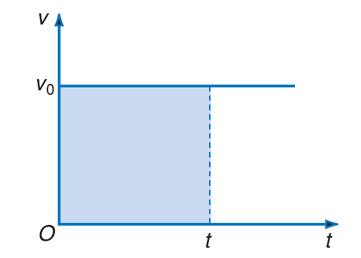
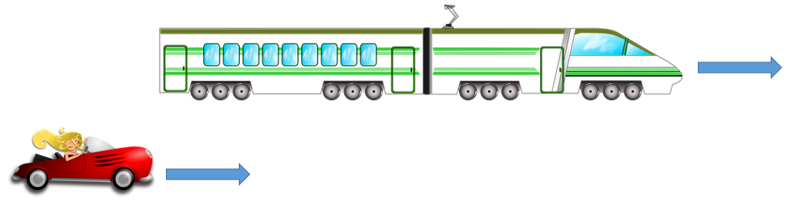
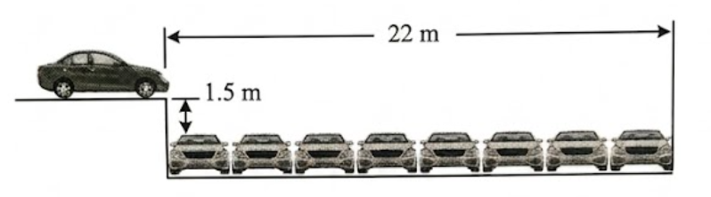
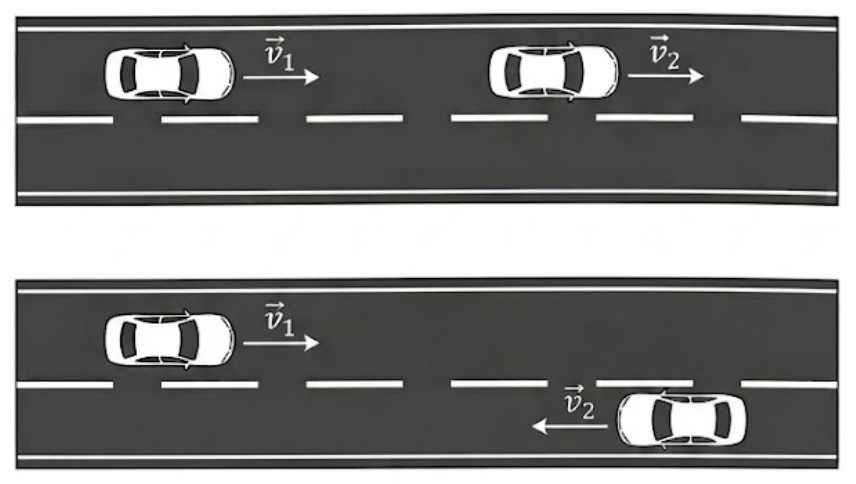
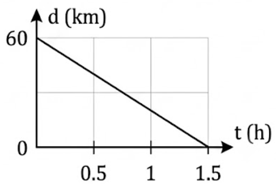

# Động học
## Độ dịch chuyển và quãng đường đi được
**Vị trí của vật chuyển động tại các thời điểm:**

Để xác định vị trí của vật chuyển động tại các thời điểm ta chọn một hệ tọa độ gắn với vật làm mốc, một mốc thời gian và đồng hồ đo thời gian, gọi là ***hệ quy chiếu***.

Nếu vật chuyển động trên một đường thẳng, để khảo sát vị trí của vật ta chỉ cần chọn một trục Ox trùng với quỹ đạo của vật.

{width="70%" fig-align="center"}

Nếu vật chuyển động trong một mặt phẳng, để khảo sát vị trí của vật ta chọn hai trục Ox, Oy vuông góc nhau.

{width="70%" fig-align="center"}

**Độ dịch chuyển:**

Độ dịch chuyển là một vectơ cho biết độ dài, phương và hướng của sự thay đổi vị trí của vật. Kí hiệu là $\vec{d}$.

Vật đi từ A đến B rồi đi từ B đến C thì độ dịch chuyển là vector $\vec{d} = \overrightarrow{AC} $.

*(Sơ đồ minh họa: Vật di chuyển từ $A \rightarrow B \rightarrow C$, độ dịch chuyển tổng hợp là $\vec{d} = \vec{AC}$)*

**Độ dịch chuyển và quãng đường:**
Chỉ khi vật chuyển động thẳng theo một chiều (không đổi chiều) thì độ lớn của độ dịch chuyển bằng với quãng đường đi được của vật. Còn các trường hợp còn lại thì độ dịch chuyển và quãng đường là khác nhau.

**Tổng hợp độ dịch chuyển:**
Độ dịch chuyển là đại lượng vectơ nên khi tổng hợp độ dịch chuyển sẽ tuân theo quy tắc cộng vectơ (quy tắc hình bình hành).
Trong ví dụ trên ta có: $\vec{d} = \overrightarrow{AB} + \overrightarrow{BC}$

## Tốc độ và vận tốc

**Tốc độ:** Đặc trưng cho sự nhanh hay chậm của chuyển động của vật.

* Tốc độ trung bình: $\displaystyle \vert v \vert = \frac{s}{t}$ hay $\displaystyle \vert v \vert = \frac{\Delta s}{\Delta t}$
* Tốc độ tức thời là tốc độ tại một thời điểm xác định.
* Đơn vị của tốc độ: m/s ; km/h ; ...

*(Chú thích hình: Tốc kế chỉ tốc độ tức thời của xe)*

**Vận tốc:** Đặc trưng cho sự nhanh hay chậm và phương chiều của chuyển động của vật, vận tốc là đại lượng vectơ.

* Vận tốc trung bình: $\displaystyle \vec{v} = \frac{\vec{d}}{t}$ hay $\displaystyle \vec{v} = \frac{\Delta \vec{d}}{\Delta t}$
* Vận tốc tức thời là vận tốc tại một thời điểm xác định.
* Đơn vị của vận tốc: m/s ; km/h ; ...

**Công thức cộng vận tốc:** $\vec{v}_{1,3} = \vec{v}_{1,2} + \vec{v}_{2,3}$ \\
(vận tốc là đại lượng vectơ nên cộng vận tốc phải theo quy tắc cộng vectơ, quy tắc hình bình hành).

*(Chú thích hình: Người ngồi trong ô tô đang chuyển động thấy giọt mưa rơi xiên)*

## Chuyển động thẳng đều

Chuyển động thẳng đều là chuyển động có quỹ đạo là đường thẳng và đi được những quãng đường bằng nhau trong những khoảng thời gian như nhau. Trong chuyển động thẳng đều, vận tốc là đại lượng không đổi.

$$
  v = \frac{\Delta d}{\Delta t}
$$

* $v$ là vận tốc ($\text{km/h}, \text{m/s}$)
* $d$ là độ dịch chuyển ($\text{km}, \text{m}$)
* $t$ là thời gian chuyển động ($\text{h}, \text{s}$)

**Phương trình chuyển động thẳng đều:**
Ta có: $\displaystyle v = \frac{\Delta d}{\Delta t} = \frac{x - x_0}{t - 0}$
$\implies x = x_0 + v \cdot t$

*Trong đó:*

* $x_0$ là tọa độ của vật tại thời điểm ban đầu $t = 0$.
* $x$ là tọa độ tại thời điểm $t$ sau đó.

**Đồ thị vận tốc theo thời gian:**

{width="70%" fig-align="center"}

Quãng đường: $s = v \cdot t = \text{diện tích hình chữ nhật}$

**Đồ thị độ dịch chuyển – thời gian:**

* Từ $\displaystyle v = \frac{d}{t} \implies d = v \cdot t$ ta có đồ thị có dạng sau:
* Độ dốc của đồ thị bằng với vận tốc của vật: $\tan \alpha = v$

{#fig-particle-position width="70%" fig-align="center"}

## Chuyển động thẳng biến đổi đều

Chuyển động có vận tốc thay đổi theo thời gian được gọi là chuyển động biến đổi.

**Gia tốc** là đại lượng đặc trưng cho sự biến đổi nhanh hay chậm của vận tốc.

*Gia tốc trung bình* được tính công thức:
$$\vec{a}_{tb} = \frac{\vec{v}_t - \vec{v}_0}{t - t_0} = \frac{\Delta \vec{v}}{\Delta t}$$

Vector gia tốc trung bình có cùng phương với quỹ đạo, giá trị đại số của nó là:
$$
  a_{tb} = \frac{v_t - v_0}{t - t_0} = \frac{\Delta v}{\Delta t}
$$

Trong phần này ta chỉ tìm hiểu chuyển động biến đổi đơn giản nhất là chuyển động thẳng biến đổi đều.
**Chuyển động thẳng biến đổi đều** là chuyển động thẳng và vectơ gia tốc không đổi theo thời gian.

* Nếu vận tốc tăng đều theo thời gian: **Chuyển động thẳng nhanh dần đều.**
* Nếu vận tốc giảm đều theo thời gian: **Chuyển động thẳng chậm dần đều.**

> ***Lưu ý:**
>
> * **Chuyển động thẳng nhanh dần đều:** $\vec{a}$ và $\vec{v}$ cùng chiều hay $a$ và $v$ cùng dấu $(a \cdot v > 0)$.
> * **Chuyển động thẳng chậm dần đều:** $\vec{a}$ và $\vec{v}$ ngược chiều hay $a$ và $v$ ngược dấu $(a \cdot v < 0)$.
> * **Đơn vị của gia tốc là:** $\text{m/s}^2$.

**Các công thức của chuyển động thẳng biến đổi đều:**

$$v_t = v_0 + at$$

$$d = v_0 t + \frac{1}{2} a t^2$$

$$v_t^2 - v_0^2 = 2ad$$

**Đồ thị vận tốc – thời gian:** $v_t = v_0 + at$

Quãng đường: $S = \frac{1}{2}(v + v_0) \cdot t = v_{tb} \cdot t = \text{diện tích hình thang (gạch sọc)}.$

## Rơi tự do

Rơi tự do là sự rơi chỉ dưới tác dụng của trọng lực (trong trường hợp vật rơi trong không khí mà lực cản không khí rất nhỏ so với trọng lực của vật thì vẫn có thể coi gần đúng là rơi tự do).

Chuyển động rơi tự do là chuyển động thẳng nhanh dần đều, phương thẳng đứng chiều từ trên xuống.

**Gia tốc rơi tự do:**

* Ở cùng một nơi trên Trái Đất mọi vật rơi tự do với cùng một gia tốc.
* Gia tốc rơi tự do được kí hiệu là $\vec{g}$, giá trị của $g$ phụ thuộc vào vĩ độ địa lý và độ cao. Ở gần bề mặt Trái Đất người ta thường lấy $g = 9.8\text{ m/s}^2$.
* Gia tốc $\vec{g}$ luôn có phương thẳng đứng, chiều hướng từ trên xuống.

**Các công thức của rơi tự do ($v_0 = 0$)**
$$v = gt$$

$$d = s = \frac{1}{2}gt^2$$

$$v^2 = 2gs$$

## Chuyển động ném

### Chuyển động ném ngang

Xét một vật được ném ngang từ điểm O ở độ cao H so với mặt đất. Chọn hệ quy chiếu như hình vẽ.

**Xét theo phương Ox:** vật chuyển động thẳng đều nên ta có:

$$v_x = v_0 \ x = v_x t = v_0 t \Rightarrow t = \dfrac{x}{v_0} \quad (1) $$

**Xét theo phương Oy:** vật rơi tự do với vận tốc ban đầu bằng 0 nên ta có:

$$v_y = gt \ y = \dfrac{1}{2}gt^2 \quad (2) $$

**Thay (1) vào (2) ta được:** $y = \dfrac{1}{2}g \left(\dfrac{x}{v_0}\right)^2 = \dfrac{g}{2v_0^2} \cdot x^2$.

$\implies$ Quỹ đạo chuyển động của vật là một nhánh Parabol.

**Thời gian rơi:**
$$y = H = \frac{1}{2}gt^2 \Rightarrow t = \sqrt{\frac{2H}{g}}$$

**Tầm bay xa của vật theo phương ngang:**

$$L = x_{\text{max}} = v_0 t = v_0 \sqrt{\frac{2H}{g}}$$

**Vận tốc của vật khi chạm đất:**

$$v_{\text{cđ}} = \sqrt{v_x^2 + v_y^2} = \sqrt{v_0^2 + 2gH}$$

### Chuyển động ném xiên

Xét một vật được ném xiên từ điểm O trên mặt đất với vận tốc ban đầu $\vec{v}_0$ hợp với phương ngang một góc $\alpha$.

Theo Ox vật chuyển động thẳng đều nên ta có:

$$
\begin{align}
  v_x &= v_{0x} = v_0 \cos \alpha \ x = v_x t = v_0 \cos \alpha \cdot t \\ 
  \Rightarrow t &= \dfrac{x}{v_0 \cos \alpha} \quad (1)
\end{align}
$$

Theo Oy vật chuyển động thẳng biến đổi đều với gia tốc $-\vec{g}$:

$$
  \begin{cases}
    v_{0y} = v_0 \sin \alpha \ v_y = v_{0y} - gt = v_0 \sin \alpha - gt \\
    y = v_{0y} t - \dfrac{1}{2}gt^2 = v_0 \sin \alpha \cdot t - \dfrac{1}{2}gt^2 \quad (2)
  \end{cases}
$$

Thay (1) vào (2) ta được:

$$y = v_0 \sin \alpha \cdot \frac{x}{v_0 \cos \alpha} - \frac{1}{2}g \left(\frac{x}{v_0 \cos \alpha}\right)^2 = -\frac{g}{2v_0^2 \cos^2 \alpha} x^2 + x \cdot \tan \alpha$$

$\Rightarrow$ Quỹ đạo là Parabol.

**Thời gian từ lúc ném đến khi vật rơi chạm đất:** khi chạm đất $y = 0$ từ (2) ta có:

$$t = \frac{2v_0 \sin \alpha}{g}$$

**Tầm bay xa theo phương ngang:**

$$L = x_{\text{max}} = v_0 \cos \alpha \cdot \frac{2v_0 \sin \alpha}{g} = \frac{v_0^2 \sin 2\alpha}{g}$$

**Tầm bay cao:**

$$H = y_{\text{max}} = \frac{v_0^2 \sin^2 \alpha}{2g}$$

## Bài tập minh họa {.unnumbered}

**Dạng 1. Chuyển động thẳng đều**

**Bài 1.** Một ô tô chuyển động thẳng đều với vận tốc 95 km/h trên đường quốc lộ song song với đường ray của một tàu hỏa đang chuyển động thẳng đều với vận tốc 75 km/h. Ô tô và tàu hỏa chuyển động cùng chiều. Biết chiều dài của tàu hỏa là 1.3 km. Hỏi sau bao lâu thì ô tô vượt qua hết chiều dài tàu hỏa và quãng đường ô tô đi được trong thời gian đó. Kết quả bài toán sẽ ra sao nếu ô tô và tàu hỏa đi ngược chiều.

{width="70%" fig-align="center"}

**Bài 2.** Lúc 7 giờ sáng một xe ô tô xuất phát ưừ tỉnh A đi đến tỉnh B với tốc độ 60 km/h. Nửa giờ sau, một ô tô khác xuất phát từ tỉnh B đi đến tỉnh A với tốc độ 40 km/h. Coi đường đi giữa hai tỉnh A và B là đường thẳng, cách nhau 180 km và các ô tô chuyển động thằng đều.

1. Lập phương trình chuyển động của các xe ô tô.
2. Xác định vị trí và thời điểm hai xe gặp nhau.
3. Xác định các thời điểm mà các xe đi đến nơi đã định.
   
**Dạng 2. Tính tốc độ trung bình**

**Bài 3.** Một người tập thể dục chạy trên một đường thẳng. Lúc đầu người đó chạy với tốc độ trung bình 5 m/s trong thời gian 4 phút. Sau đó người đó giảm tốc độ xuống còn 4 m/s trong thời gian 3 phút.

1. Hỏi người đó chạy đường quãng đường bằng bao nhiêu?
2. Tính tốc độ trung bình của người đó trong toàn bộ thời chạy.

**Dạng 3. Chuyển động biến đổi đều**

**Dạng 4. Rơi tự do**

**Dạng 5. Chuyển động của vật bị ném**

**Dạng 6. Công thức cộng vận tốc**

## Bài tập tự luyện {.unnumbered}
**Bài 1.** Một xe khởi hành từ địa điểm A lúc 8 giờ sáng đi tới địa điểm B cách A 110 km, chuyển động thằng đều với tốc độ 40 km/h. Một xe khác khởi hành từ B lúc 8 giờ 30 phút sáng đi về A, chuyển động thẳng đều với tốc độ 50 km/h. Vẽ đồ thị độ dịch chuyển - thời gian của hai xe và dựa vào đó xác định khoảng cách giữa hai xe lúc 9 giờ sáng và thời gian, địa điểm hai xe gặp nhau.

**Bài 2.** Một người lái mô tô đi trên một đoạn đường $s$, trong một phần ba thời gian đầu mô tô đi với tốc độ 50 km/h, một phần ba thời gian tiếp theo đi với tốc độ 60 km/h và trong một phần ba thời gian còn lại, đi với tốc độ 10 km/h. Tính tốc độ trung bình của mô tô trên cả quãng đường.

**Bài 3.** Một người đi xe đạp đi nửa đoạn đường đầu tiên với tốc độ 12 km/h và nửa đoạn đường sau với tốc độ 20 km/h. Tính tốc độ trung bình của người đi xe đạp trên cả đoạn đường.

**Bài 4.** Một vận động viên chạy bộ trong thời gian 3s, vận động viên chạy từ vị trí có tọa độ $x_1 = 50\text{ m}$ đến vị trí có tọa độ $x_2 = 30.5\text{ m}$ trên trục Ox như hình vẽ. Tính vận tốc trung bình của vận động viên.

**Bài 5.** Một người lái ô tô đang chuyển động với vận tốc 35 km/h, khi xe còn cách ngã tư 28m thì người này thấy đèn tín hiệu chuyển sang màu vàng, người này biết sau 2.0s thì đèn sẽ chuyển sang màu đỏ, ngã tư rộng 15m. Hỏi người này nên giảm tốc độ cho xe dừng lại hay tiếp tục tăng tốc để cho xe vượt qua hết ngã tư trước khi đèn tín hiệu chuyển sang màu đỏ. Biết xe có thể giảm tốc với gia tốc tối đa là $-5.8\text{ m/s}^2$ và có thể tăng tốc tối đa từ 45 km/h lên 65 km/h trong 6.0s.

**Bài 6.** Một ca nô tăng tốc đều đặn từ $15\text{ m/s}$ đến $27\text{ m/s}$ trên một quãng đường thẳng dài $80\text{ m}$. Hãy xác định gia tốc của ca nô và thời gian ca nô tăng tốc chạy.

**Bài 7.** Một electron có vận tốc ban đầu là $5 \times 10^5\text{ m/s}$, có gia tốc $8 \times 10^4\text{ m/s}^2$. Tính thời gian để nó đạt vận tốc $5.4 \times 10^5\text{ m/s}$ và quãng đường mà nó đi được trong thời gian trên.

**Bài 8.** Lúc 8 giờ sáng một ô tô đi qua điểm A trên một đường thẳng với vận tốc $10\text{ m/s}$, chuyển động chậm dần đều với gia tốc $0.2\text{ m/s}^2$. Cùng lúc đó tại điểm B cách A $560\text{ m}$, một ô tô thứ hai bắt đầu khởi hành đi ngược chiều với xe thứ nhất, chuyển động nhanh dần đều với gia tốc $0.4\text{ m/s}^2$.

1. Viết phương trình chuyển động của 2 xe.
2. Xác định vị trí và thời điểm 2 xe gặp nhau.
3. Hãy cho biết xe thứ nhất dừng lại cách A bao nhiêu mét.

**Bài 9.** Một vật chuyển động có đồ thị gia tốc theo thời gian được cho bởi hình bên.

1. Vật bắt đầu chuyển động từ trạng thái nghỉ, xác định vận tốc của vật theo thời gian.
2. Tại thời điểm $t = 0$ vật có vận tốc $40\text{ m/s}$, xác định vận tốc của vật theo thời gian.

**Bài 10.** Một ô tô bắt đầu chuyển động từ trạng thái nghỉ $v_1 = 0\text{ km/h}$ sau thời gian 5s vận tốc của ô tô là $v_2 = 75\text{ km/h}$. Tính gia tốc của ô tô và quãng đường ô tô đi được trong thời gian trên.

**Bài 11.** Một ô tô đang chuyển động thẳng với vận tốc $15\text{ m/s}$ thì tài xế hãm phanh, sau 5s vận tốc ô tô giảm còn $5\text{ m/s}$. Tính gia tốc của ô tô và quãng đường ô tô đi được từ lúc hãm phanh cho đến khi dừng lại.

**Bài 30**. Một ô tô chạy với vận tốc 50 km/h trong trời mưa. Mưa rơi theo phương thẳng đứng. Trên cửa kính bên của xe, các vệt mưa làm với phương thẳng đứng một góc $60^\circ$.

1. Xác định vận tốc của giọt mưa đối với xe ô tô.
2. Xác định vận tốc của giọt mưa đối với mặt đất.

(Chú thích hình: Người ngồi trong ô tô đang chuyển động thấy giọt mưa rơi xiên)

**Bài 31.** Từ một khinh khí cầu đang hạ thấp đều với vận tốc $v_0 = 2\text{ m/s}$ (so với mặt đất), người ta phóng một vật thẳng đứng hướng lên với vận tốc $v = 18\text{ m/s}$ (so với mặt đất). Lấy $g = 10\text{ m/s}^2$.

1. Tính khoảng cách giữa khí cầu và vật khi vật lên tới vị trí cao nhất.
2. Sau bao lâu vật rơi trở lại gặp khí cầu.

## Câu hỏi trắc nghiệm {.unnumbered}

**Câu 1.** Có hai vật (1) và (2). Nếu chọn vật (1) làm mốc thì vật (2) chuyển động tròn đều với bán kính R so với (1). Nếu chọn (2) làm mốc thì có thể phát biểu về quỹ đạo của (1) so với (2) như thế nào?

* A. Không có quỹ đạo vì vật (1) nằm yên.
* B. Là đường thẳng.
* C. Là đường tròn có bán kính khác R.
* D. Là đường tròn có bán kính R.

**Câu 2.** Có 3 vật (1), (2) và (3). Áp dụng công thức cộng vận tốc. Hãy chọn biểu thức **sai**?

* A. $\vec{v}_{2,3} = \vec{v}_{2,1} + \vec{v}_{1,3}$
* B. $\vec{v}_{13} = \vec{v}_{12} + \vec{v}_{23}$
* C. $\vec{v}_{32} = \vec{v}_{31} - \vec{v}_{21}$
* D. $\vec{v}_{12} = \vec{v}_{13} + \vec{v}_{21}$

**Câu 3.** Trường hợp nào sau đây người ta nói đến vận tốc tức thời?

* A. Ô tô chạy từ Phan Thiết vào Biên Hoà với vận tốc $50\text{ km/h}$.
* B. Tốc độ tối đa khi xe chạy trong thành phố là $40\text{ km/h}$.
* C. Viên đạn ra khỏi nòng súng với vận tốc $300\text{ m/s}$.
* D. Tốc độ tối thiểu khi xe chạy trên đường cao tốc là $80\text{ km/h}$.

**Câu 4.** Phương trình nào sau là phương trình vận tốc của chuyển động chậm dần đều (chiều dương cùng chiều chuyển động)?

* A. $v = 5t$
* B. $v = 15 - 3t$
* C. $v = 10 + 5t + 2t^2$
* D. $v = 20 - \dfrac{t^2}{2}$
  
**Câu 5.** Trong chuyển động thẳng biến đổi đều lúc đầu vật có vận tốc $\vec{v}_1$; sau khoảng thời gian $\Delta t$ vật có vận tốc $\vec{v}_2$. Vectơ gia tốc $\vec{a}$ có chiều nào sau?

* A. Chiều của $\vec{v}_2 - \vec{v}_1$.
* B. Chiều ngược với $\vec{v}_1$.
* C. Chiều của $\vec{v}_2 + \vec{v}_1$.
* C. Chiều của $\vec{v}_2$.

**Câu 6.** Tìm phát biểu đúng?

* A. Mọi vật rơi trong không khí luôn là sự rơi tự do.
* B. Chuyển động rơi tự do có gia tốc lớn hơn trong chuyển động thẳng biến đổi đều.
* C. Chuyển động rơi tự do là chuyển động thẳng đều.
* D. Sự rơi tự do là sự rơi chỉ dưới tác dụng của trọng lực.

**Câu 7.** Vật chuyển động chậm dần đều

* A. Vectơ gia tốc của vật cùng chiều với vectơ vận tốc.
* B. Gia tốc của vật luôn luôn dương.
* C. Vectơ gia tốc của vật ngược chiều với vectơ vận tốc.
* D. Gia tốc của vật luôn luôn âm.

**Câu 8.** Chọn câu đúng

* A. Gia tốc của chuyển động thẳng nhanh dần đều lớn hơn gia tốc của chuyển động thẳng chậm dần đều.
* B. Chuyển động thẳng nhanh dần đều có gia tốc lớn thì có vận tốc lớn.
* C. Gia tốc trong chuyển động thẳng nhanh dần đều có phương, chiều và độ lớn không đổi.
* D. Chuyển động thẳng biến đổi đều có gia tốc tăng, giảm đều theo thời gian.

**Câu 9.** Trong chuyển động thẳng nhanh dần đều

* A. vận tốc $v$ luôn luôn dương.
* B. gia tốc $a$ luôn luôn dương.
* C. $a$ luôn luôn cùng dấu với $v$.
* D. $a$ luôn luôn ngược dấu với $v$.

**Câu 10.** Một người đang ở trên một khí cầu đang chuyển động đều theo phương thẳng đứng hướng lên thì người đó làm rơi một vật nặng ra ngoài. Bỏ qua lực cản không khí sau khi rời khỏi khí cầu, vật nặng

* A. Rơi tự do.
* B. Chuyển động lúc đầu là chậm dần đều sau đó là nhanh dần đều.
* C. Chuyển động đều.
* D. Bị hút theo khí cầu nên không thể rơi xuống đất.

**Câu 11.** Một vận động viên đá các quả bóng chuyển động trong không khí theo các quỹ đạo như trong hình vẽ, các quỹ đạo đều có cùng độ cao cực đại là h. Bỏ qua lực cản của không khí. Quỹ đạo có thời gian chuyển động lâu nhất

* A. quỹ đạo A.
* B. quỹ đạo B.
* C. quỹ đạo C.
* D. ba quỹ đạo có thời gian chuyển động bằng nhau.

**Câu 12.** Phương trình độ dịch chuyển của một vật chuyển động thẳng biến đổi đều (dấu của $d_0, v_0, a$ tuỳ theo gốc và chiều dương của trục tọa độ) là

* A. $d = d_0 + v_0 t - \dfrac{at^2}{2}$
* B. $d = d_0 + v_0 t + \dfrac{at^2}{2}$
* C. $d = d_0 + v_0 + \dfrac{at^2}{2}$
* D. $d = d_0 + v_0 t + \dfrac{at}{2}$

**Câu 13.** Hai ô tô chuyển động thẳng đều với cùng độ lớn vận tốc v. Khi gặp nhau ở một ngã tư thì xe (1) chạy theo hướng Bắc, còn xe (2) chạy theo hướng Đông. Người quan sát trên xe (1) thấy xe (2) chuyển động theo hướng

* A. Đông.
* B. Đông - Bắc.
* C. Tây - Bắc.
* D. Đông – Nam.

**Câu 14.** Một người đang chạy xe ô tô thì nhìn vào đồng hồ đo tốc độ (tốc kế). Kim đồng hồ chỉ 75 km/h, có nghĩa là

* A. trong 1 giờ đầu xe đã chạy được quãng đường là 75 km.
* B. tốc độ tức thời của xe máy tại thời điểm xem là 75 km/h.
* C. tốc độ trung bình của xe là 75 km/h.
* D. tốc độ tối đa của xe có thể chạy là 75 km/h.

**Câu 15.** Hai học sinh lần lượt đi trên thang cuốn đang hoạt động trong một siêu thị. Học sinh thứ nhất đi với tốc độ $v_1$, khi đi hết thang thì bước được 30 bậc. Học sinh thứ hai đi với tốc độ $v_2$ và cùng chiều đi với học sinh thứ nhất, khi đi hết thang thì bước được 40 bậc. Phát biểu nào sau đây là đúng?

* A. Hai học sinh đi ngược chiều chuyển động của thang cuốn và $v_1 < v_2$.
* B. Hai học sinh đi cùng chiều chuyển động của thang cuốn và $v_1 > v_2$.
* C. Hai học sinh đi ngược chiều chuyển động của thang cuốn và $v_1 > v_2$.
* D. Hai học sinh đi cùng chiều chuyển động của thang cuốn và $v_1 = v_2$.
  
**Câu 16.** Một người đi xe đạp trên nửa đoạn đường đầu tiên với tốc độ $30\text{ km/h}$, trên nửa đoạn đường thứ hai với tốc độ $20\text{ km/h}$. Tốc độ trung bình trên cả quãng đường là

* A. $28\text{ km/h}$.
* B. $25\text{ km/h}$.
* C. $24\text{ km/h}$.
* D. $22\text{ km/h}$.

**Câu 17.** Một ô tô chuyển động từ A đến B. Trong nửa thời gian đầu ô tô chuyển động với tốc độ $40\text{ km/h}$, trong nửa thời gian sau ô tô chuyển động với tốc độ $60\text{ km/h}$. Tốc độ trung bình trên cả quãng đường là

* A. $55\text{ km/h}$.
* B. $50\text{ km/h}$.
* C. $48\text{ km/h}$.
* D. $45\text{ km/h}$.

**Câu 18.** Khi ô tô đang chạy với vận tốc $10\text{ m/s}$ trên đoạn đường thẳng thì người lái hãm phanh và ô tô chuyển động chậm dần đều. Sau khi đi được quãng đường $100\text{ m}$ ô tô dừng lại. Chọn chiều dương cùng chiều chuyển động. Gia tốc chuyển động của ô tô là

* A. $0.5\text{ m/s}^2$.
* B. $1\text{ m/s}^2$.
* C. $-2\text{ m/s}^2$.
* D. $-0.5\text{ m/s}^2$.

**Câu 19.** Một ô tô bắt đầu chuyển bánh và chuyển động nhanh dần đều trên một đoạn đường thẳng. Sau 10 giây kể từ lúc chuyển bánh ô tô đạt vận tốc $36\text{ km/h}$. Chọn chiều dương ngược chiều chuyển động thì gia tốc chuyển động của ô tô là

* A. $-1\text{ m/s}^2$.
* B. $1\text{ m/s}^2$.
* C. $0.5\text{ m/s}^2$.
* D. $-0.5\text{ m/s}^2$.

**Câu 20.** Một vật chuyển động có phương trình vận tốc $v = (10 + 2t)\text{ (m/s)}$. Sau 10 giây vật đi được quãng đường

* A. $30\text{ m}$.
* B. $110\text{ m}$.
* C. $200\text{ m}$.
* D. $300\text{ m}$.

**Câu 21.** Một ô tô đang chuyển động với vận tốc $10\text{ m/s}$ trên đoạn đường thẳng thì lái xe hãm phanh, ô tô chuyển động chậm dần đều, sau $20\text{ s}$ thì xe dừng lại. Quãng đường mà ô tô đi được từ lúc hãm phanh đến lúc dừng lại là

* A. $50\text{ m}$.
* B. $100\text{ m}$.
* C. $150\text{ m}$.
* D. $200\text{ m}$.
  
**Câu 22.** Một vật chuyển động thẳng nhanh dần đều với vận tốc ban đầu $5\text{ m/s}$ và với gia tốc $2\text{ m/s}^2$ thì đường đi (tính ra mét) của vật theo thời gian (tính ra giây) được tính theo công thức

* A. $s = 5 + 2t$.
* B. $s = 5t + 2t^2$.
* C. $s = 5t - t^2$.
* D. $s = 5t + t^2$.

**Câu 23.** Một vật chuyển động thẳng chậm dần đều với vận tốc ban đầu $20\text{ m/s}$ và với gia tốc $0.4\text{ m/s}^2$ thì đường đi (tính ra mét) của vật theo thời gian (tính ra giây) khi $t < 50\text{ giây}$ được tính theo công thức

* A. $s = 20t - 0.2t^2$.
* B. $s = 20t + 0.2t^2$.
* C. $s = 20 + 0.4t$.
* D. $s = 20t - 0.4t^2$.

**Câu 24.** Phương trình chuyển động của một vật là $d = 10 + 3t + 0.2t^2$ ($d$ tính bằng mét, $t$ tính bằng giây). Quãng đường vật đi được tính từ thời điểm $t = 0$ đến thời điểm $t = 10\text{ s}$ là

* A. $60\text{ m}$.
* B. $50\text{ m}$.
* C. $30\text{ m}$.
* D. $20\text{ m}$.

**Câu 25.** Một đoàn tàu bắt đầu rời ga, chuyển động nhanh dần đều, sau khi đi được quãng đường $1000\text{ m}$ tàu đạt vận tốc $20\text{ m/s}$. Chọn chiều dương cùng chiều chuyển động thì gia tốc chuyển động của tàu là

* A. $0.2\text{ m/s}^2$.
* B. $-0.2\text{ m/s}^2$.
* C. $0.4\text{ m/s}^2$.
* D. $-0.4\text{ m/s}^2$.

**Câu 26.** Một vật được thả rơi không vận tốc đầu từ độ cao $20\text{ m}$, lấy $g = 10\text{ m/s}^2$. Bỏ qua lực cản không khí. Hỏi sau bao lâu vật sẽ chạm đất?

* A. $2\text{ s}$.
* B. $3\text{ s}$.
* C. $4\text{ s}$.
* D. $5\text{ s}$.

**Câu 27.** Một vật rơi tự do sau thời gian 4 giây thì chạm đất. Lấy $g = 10\text{ m/s}^2$. Quãng đường vật rơi trong giây cuối cùng trước khi chạm đất là

* A. $75\text{ m}$.
* B. $35\text{ m}$.
* C. $45\text{ m}$.
* D. $5\text{ m}$.

**Câu 28.** Vật rơi tự do từ độ cao $s_1$ xuống mặt đất trong thời gian $t_1$, từ độ cao $s_2$ xuống mặt đất trong thời gian $t_2$. Biết $t_2 = 2t_1$. Tỉ số $s_2/s_1$ là

* A. $0.25$.
* B. $4$.
* C. $2$.
* D. $0.5$.

**Câu 29.** Thả hai vật rơi tự do đồng thời từ hai độ cao $s_1, s_2$. Vật thứ nhất chạm đất với vận tốc $v_1$. Thời gian rơi của vật thứ hai gấp 3 lần thời gian rơi của vật thứ nhất. Vận tốc chạm đất $v_2$ của vật thứ hai là

* A. $2v_1$.
* B. $3v_1$.
* C. $4v_1$.
* D. $9v_1$.

**Câu 30.** Thả một hòn sỏi rơi tự do từ độ cao $s$ xuống đất. Trong giây cuối cùng trước khi chạm đất hòn sỏi rơi được quãng đường $15\text{ m}$. Lấy $g = 10\text{ m/s}^2$. Độ cao $h$ thả hòn sỏi là

* A. $10\text{ m}$.
* B. $15\text{ m}$.
* C. $20\text{ m}$.
* D. $25\text{ m}$.

**Câu 31.** Một ca nô chạy ngược dòng sông, sau 1 giờ đi được $15\text{ km}$. Một khúc gỗ trôi xuôi theo dòng sông với vận tốc $2\text{ km/h}$. Vận tốc của ca nô so với nước là

* A. $30\text{ km/h}$.
* B. $17\text{ km/h}$.
* C. $13\text{ km/h}$.
* D. $7.5\text{ km/h}$.

**Câu 32.** Một diễn viên đóng thế muốn điều khiển ô tô của mình chuyển động qua 8 ô tô đậu cạnh nhau bên dưới một đoạn đường dốc ngang như hình vẽ. Biết chiều cao của đoạn đường dốc là $1.5\text{ m}$, khoảng cách theo phương ngang của 8 ô tô là $22\text{ m}$. Lấy $g = 10\text{ m/s}^2$; bỏ qua sức cản không khí. Tốc độ tối thiểu của ô tô khi rời khỏi đoạn đường dốc là

{width="50%" fig-align="center"}

:::: {.columns}
::: {.column width="25%"}
**A.** 40.2 m/s
:::
::: {.column width="25%"}
**B.** 56.8 m/s
:::
::: {.column width="25%"}
**C.** 170.4 m/s
:::
::: {.column width="25%"}
**D.** 12 m/s
:::
::::
**Câu 33.** Lúc 7 giờ sáng, tại A xe thứ nhất chuyển động thẳng đều với tốc độ $12\text{ km/h}$ để về B. Một giờ sau, tại B xe thứ hai chuyển động thẳng đều với tốc độ $48\text{ km/h}$ theo chiều ngược lại để về A. Cho đoạn thẳng $AB = 72\text{ km}$. Khoảng cách giữa hai xe lúc 10 giờ là

:::: {.columns}
::: {.column width="25%"}
**A**. 12 km.
:::
::: {.column width="25%"}
**B**. 60 km.
:::
::: {.column width="25%"}
**C**. 36 km.
:::
::: {.column width="25%"}
**D**. 24 km.
:::
::::

:::: {.columns}
::: {.column width="60%"}
**Câu 34.** Hai ô tô cùng chuyển động thẳng đều từ hai bến xe A và B cách nhau $20\text{ km}$ trên một đoạn đường thẳng. Nếu hai ô tô chạy ngược chiều thì chúng sẽ gặp nhau sau 15 phút. Nếu hai ô tô chạy cùng chiều thì chúng sẽ đuổi kịp nhau sau 1 giờ. Vận tốc của hai ô tô lần lượt là:
:::
::: {.column width="40%"}

:::
::::

* A. $v_1 = 80\text{ km/h}; v_2 = 20\text{ km/h}$.
* B. $v_1 = 60\text{ km/h}; v_2 = 40\text{ km/h}$.
* C. $v_1 = 40\text{ km/h}; v_2 = 20\text{ km/h}$.
* D. $v_1 = 50\text{ km/h}; v_2 = 30\text{ km/h}$.

::: {.columns}

::: {.column width="70%"}

**Câu 35.** Đồ thị độ dịch chuyển theo thời gian của một người đi xe đạp trên một đường thẳng được biểu diễn trên hình vẽ bên. Quãng đường xe đi được trong khoảng thời gian từ thời điểm $t_1 = 0.5\text{h}$ đến $t_2 = 1\text{h}$ bằng

:::

::: {.column width="30%"}

:::

:::

* A. $20\text{ km}$.
* B. $60\text{ km}$.
* C. $40\text{ km}$.
* D. $30\text{ km}$.
  
**Câu 36.** Hai xe ô tô A, B chuyển động thẳng cùng chiều với các vận tốc lần lượt là $30\text{ km/h}$ và $40\text{ km/h}$. Trong hệ quy chiếu gắn với xe A thì xe B có vận tốc là

* A. $50\text{ km/h}$
* B. $70\text{ km/h}$
* C. $10\text{ km/h}$
* D. $40\text{ km/h}$

**Câu 37.** Một quả táo rơi tự do từ độ cao $4\text{ m}$. Lấy $g = 10\text{ m/s}^2$. Vận tốc quả táo lúc chạm đất là

* A. $45\text{ m/s}$.
* B. $3\text{ m/s}$.
* C. $4\sqrt{5}\text{ m/s}$.
* D. $10\text{ m/s}$.

**Câu 38.** Đồ thị vận tốc – thời gian của một chất điểm chuyển động được cho như hình vẽ. Quãng đường mà chất điểm đi được sau $3\text{ s}$ là

* A. $10\text{ m}$.
* B. $20\text{ m}$.
* C. $30\text{ m}$.
* D. $40\text{ m}$.

**Câu 39.** Một Ô tô và một xe máy cùng xuất phát từ hai địa điểm A và B cách nhau $400\text{ m}$ từ trạng thái nghỉ và cùng chạy theo hướng AB trên đoạn đường thẳng đi qua A và B. Ô tô xuất phát từ A chuyển động nhanh dần đều với gia tốc $2.5 \cdot 10^{-2}\text{ m/s}^2$. Xe máy xuất phát từ B chuyển động nhanh dần đều với gia tốc $2.0 \cdot 10^{-2}\text{ m/s}^2$. Tại vị trí hai xe đuổi kịp nhau thì tốc độ của xe xuất phát từ A và xe xuất phát từ B lần lượt là

* A. $8\text{ m/s}$; $10\text{ m/s}$.
* B. $9\text{ m/s}$; $8\text{ m/s}$.
* C. $6\text{ m/s}$; $4\text{ m/s}$.
* D. $4\text{ m/s}$; $6\text{ m/s}$.

**Câu 40.** Một người đi xe đạp khởi hành từ A cùng lúc đó một người đi xe máy khởi hành từ B, hai người đi ngược chiều nhau đến gặp nhau. Người thứ nhất có vận tốc đầu là $18\text{ km/h}$ và chuyển động chậm dần đều với gia tốc $20\text{ cm/s}^2$. Người thứ 2 có vận tốc đầu là $5.4\text{ km/h}$ và chuyển động nhanh đều với gia tốc $0.2\text{ m/s}^2$. Khoảng cách giữa hai người lúc đầu là $130\text{ m}$. Hỏi sau bao lâu 2 người gặp nhau và vị trí gặp nhau.

* A. $t = 20\text{ s}$; cách A $60\text{ m}$.
* B. $t = 17.5\text{ s}$; cách A $56.9\text{ m}$.
* C. $t = 20\text{ s}$; cách B $60\text{ m}$.
* D. $t = 17.5\text{ s}$; cách B $56.9\text{ m}$.

<!-- ## Bài tập

Bài 1. Một xe phải đi quãng đường 120 km trong 2.5 giờ. Trong 1.5 giờ đầu xe chuyển động với tốc độ trung bình 70 km/h. Tính tốc độ trung bình của xe trong suốt quãng đường còn lại.

Bài 2. Vẽ đồ thị tọa ôộ-thời gian của vật chuyển ôộng thẳng có độ thì vận tốc-thời gian như đồ thị bên dưới. Vị trí ban đầu bằng 0 (Không cần thêm số cụ thể vào các trục).

Bài 3. Hai vận động viên xe đạp, A và B, có vị trí ban đầu lần lượt là 0km và 70km. Tại thời điểm $t = 0$, hai người bắt đầu đạp về phía nhau với tốc độ lần lượt là 15 km/h và 20 km/h. Cùng lúc đó, một con ruồi đậu ở A bắt đầu bay về phía B với tốc độ không ỏổi là 30km/h. Khi gặp B nó ngay lập tức bay về phía A, đến khi gặp A lại lập tức bay về phía B, và cứ tiếp tục như vậy cho đến khi A và B gặp nhau.

1. Xác định vị trí và thời điểm hai người gặp nhau.
2. Quãng đơờng bay của con ruồi là bao nhiêu.

Bài 4. Một vật chuyển động thẳng có đồ thị tọa độ-thời gian như sau.

1. Tính tốc độ trung bình của cả cả hành trình.
2. Tính vận tốc trung bình của cả hành trình.
 -->

