# Động học

## Độ dịch chuyển và quãng đường đi được

**Vị trí của vật chuyển động tại các thời điểm:**

Để xác định vị trí của vật chuyển động tại các thời điểm ta chọn một hệ tọa độ gắn với vật làm mốc, một mốc thời gian và đồng hồ đo thời gian, gọi là ***hệ quy chiếu***.

Nếu vật chuyển động trên một đường thẳng, để khảo sát vị trí của vật ta chỉ cần chọn một trục Ox trùng với quỹ đạo của vật.

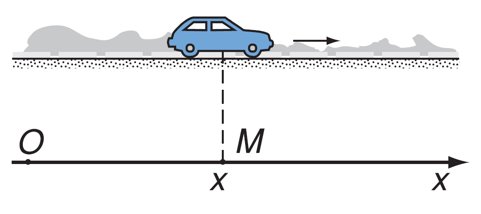{width="70%" fig-align="center"}

Nếu vật chuyển động trong một mặt phẳng, để khảo sát vị trí của vật ta chọn hai trục Ox, Oy vuông góc nhau.

{width="50%" fig-align="center"}

**Độ dịch chuyển:**

Độ dịch chuyển là một vectơ cho biết độ dài, phương và hướng của sự thay đổi vị trí của vật. Kí hiệu là $\vec{d}$.

Vật đi từ A đến B rồi đi từ B đến C thì độ dịch chuyển là vector \$\vec{d} = \overrightarrow{AC} \$.

*(Sơ đồ minh họa: Vật di chuyển từ* $A \rightarrow B \rightarrow C$, độ dịch chuyển tổng hợp là $\vec{d} = \vec{AC}$)

**Độ dịch chuyển và quãng đường:** Chỉ khi vật chuyển động thẳng theo một chiều (không đổi chiều) thì độ lớn của độ dịch chuyển bằng với quãng đường đi được của vật. Còn các trường hợp còn lại thì độ dịch chuyển và quãng đường là khác nhau.

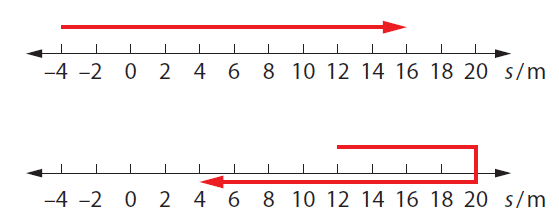

**Tổng hợp độ dịch chuyển:** Độ dịch chuyển là đại lượng vectơ nên khi tổng hợp độ dịch chuyển sẽ tuân theo quy tắc cộng vectơ (quy tắc hình bình hành). Trong ví dụ trên ta có: $\vec{d} = \overrightarrow{AB} + \overrightarrow{BC}$

## Tốc độ và vận tốc

**Tốc độ:** Đặc trưng cho sự nhanh hay chậm của chuyển động của vật.

-   Tốc độ trung bình: $\displaystyle \vert v \vert = \frac{s}{t}$ hay $\displaystyle \vert v \vert = \frac{\Delta s}{\Delta t}$
-   Tốc độ tức thời là tốc độ tại một thời điểm xác định.
-   Đơn vị của tốc độ: m/s ; km/h ; ...

*(Chú thích hình: Tốc kế chỉ tốc độ tức thời của xe)*

**Vận tốc:** Đặc trưng cho sự nhanh hay chậm và phương chiều của chuyển động của vật, vận tốc là đại lượng vectơ.

-   Vận tốc trung bình: $\displaystyle \vec{v} = \frac{\vec{d}}{t}$ hay $\displaystyle \vec{v} = \frac{\Delta \vec{d}}{\Delta t}$
-   Vận tốc tức thời là vận tốc tại một thời điểm xác định.
-   Đơn vị của vận tốc: m/s ; km/h ; ...

**Công thức cộng vận tốc:** $\vec{v}_{1,3} = \vec{v}_{1,2} + \vec{v}_{2,3}$ \\ (vận tốc là đại lượng vectơ nên cộng vận tốc phải theo quy tắc cộng vectơ, quy tắc hình bình hành).

*(Chú thích hình: Người ngồi trong ô tô đang chuyển động thấy giọt mưa rơi xiên)*

## Chuyển động thẳng đều

Chuyển động thẳng đều là chuyển động có quỹ đạo là đường thẳng và đi được những quãng đường bằng nhau trong những khoảng thời gian như nhau. Trong chuyển động thẳng đều, vận tốc là đại lượng không đổi.

$$ v = \frac{\Delta d}{\Delta t} $$

-   $v$ là vận tốc ($\text{km/h}, \text{m/s}$)
-   $d$ là độ dịch chuyển ($\text{km}, \text{m}$)
-   $t$ là thời gian chuyển động ($\text{h}, \text{s}$)

**Phương trình chuyển động thẳng đều:** Ta có: $\displaystyle v = \frac{\Delta d}{\Delta t} = \frac{x - x_0}{t - 0}$ $\implies x = x_0 + v \cdot t$

*Trong đó:*

-   $x_0$ là tọa độ của vật tại thời điểm ban đầu $t = 0$.
-   $x$ là tọa độ tại thời điểm $t$ sau đó.

**Đồ thị vận tốc theo thời gian:**

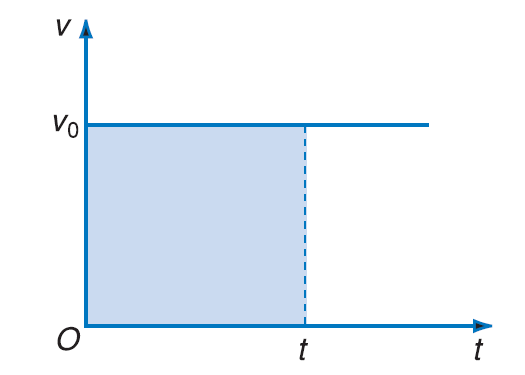{width="70%" fig-align="center"}

Quãng đường: \$s = v \cdot t = \$ diện tích hình chữ nhật

**Đồ thị độ dịch chuyển – thời gian:**

-   Từ $\displaystyle v = \frac{d}{t} \implies d = v \cdot t$ ta có đồ thị có dạng sau:
-   Độ dốc của đồ thị bằng với vận tốc của vật: $\tan \alpha = v$

{#fig-particle-position width="70%" fig-align="center"}

## Chuyển động thẳng biến đổi đều

Chuyển động có vận tốc thay đổi theo thời gian được gọi là chuyển động biến đổi.

**Gia tốc** là đại lượng đặc trưng cho sự biến đổi nhanh hay chậm của vận tốc.

*Gia tốc trung bình* được tính công thức: $$\vec{a}_{tb} = \frac{\vec{v}_t - \vec{v}_0}{t - t_0} = \frac{\Delta \vec{v}}{\Delta t}$$

Vector gia tốc trung bình có cùng phương với quỹ đạo, giá trị đại số của nó là:
$$ a_{tb} = \frac{v_t - v_0}{t - t_0} = \frac{\Delta v}{\Delta t} $$

Trong phần này ta chỉ tìm hiểu chuyển động biến đổi đơn giản nhất là chuyển động thẳng biến đổi đều. **Chuyển động thẳng biến đổi đều** là chuyển động thẳng và vectơ gia tốc không đổi theo thời gian.

- Nếu vận tốc tăng đều theo thời gian: Chuyển động thẳng nhanh dần đều.
- Nếu vận tốc giảm đều theo thời gian: Chuyển động thẳng chậm dần đều.

> *Lưu ý:*
>
> - Chuyển động thẳng nhanh dần đều: $\vec{a}$ và $\vec{v}$ cùng chiều hay $a$ và $v$ cùng dấu $(a \cdot v > 0)$.
> - Chuyển động thẳng chậm dần đều: $\vec{a}$ và $\vec{v}$ ngược chiều hay $a$ và $v$ ngược dấu $(a \cdot v < 0)$.
> - Đơn vị của gia tốc là: m/s^2^.

Các phương trình của chuyển động thẳng biến đổi điều (suvat):
$$
  \begin{align}
    v & = v_{0} + at    \tag{1} \\
    d & = \frac{v + v_{0}}{2}t    \tag{2} \\
    d & = v_{0}t + \frac{at^2}{2}    \tag{3} \\
    v^2 - v_{0}^2 &= 2ad     \tag{4}
  \end{align}
$$

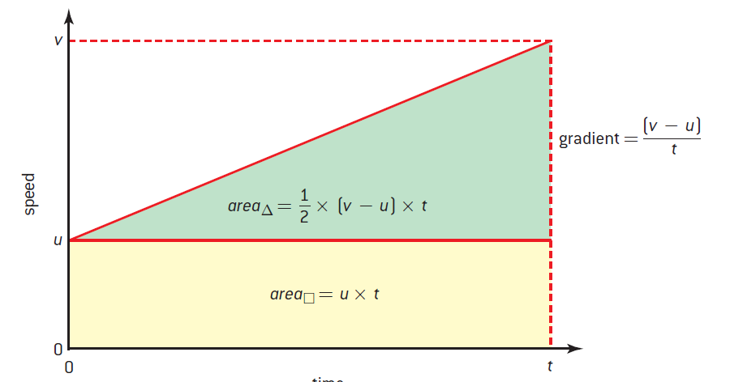{width="75%" fig-align="center"}

Phương trình (3) của chuyển động biến đổi đều có thể viết đầy đủ như sau:
$$ x = x_{0} + v_{0}t + \frac{at^2}{2} $$

## Rơi tự do

::: {.callout title="Định nghĩa"}
Rơi tự do là sự rơi của một vật chỉ chịu tác động của trọng lực
:::

Khi không có lực cản không khí, các vật có hình dạng và khối lượng khác nhau đều rơi như nhau, ta bảo rằng chúng rơi tự do.

- Khi hòn đá rơi, lực cản không khí tác động lên nó là không đáng kể so với trọng lượng của nó. Ta có thể cho hòn đá là rơi tự do.
- Khi lông chim rơi, lực cản không khí là lớn đáng kể so với trọng lượng của nó. Lông chim không rơi tự do.

Chuyển động rơi tự do là chuyển động thẳng nhanh dần đều, phương thẳng đứng và có chiều từ trên xuống dưới.

**Gia tốc rơi tự do:** Ở cùng một nơi trên Trái Đất và ở gần mặt đất, các vật rơi tự do đều có cùng một gia tốc $g$.

- Giá trị của $g$ thường được lấy là $9.8$ m/s^2^.
- Gia tốc $\vec{g}$ luôn có phương thẳng đứng, chiều hướng từ trên xuống.

Vì chuyển động rơi tự do là chuyển động biến đổi đều, nên các các công thức của chuyển động biến đổi đều có thể áp dụng khi vật rơi tự do.

## Chuyển động ném

### Chuyển động ném ngang

Xét một vật được ném ngang từ điểm O ở độ cao H so với mặt đất. Chọn hệ quy chiếu như hình vẽ.

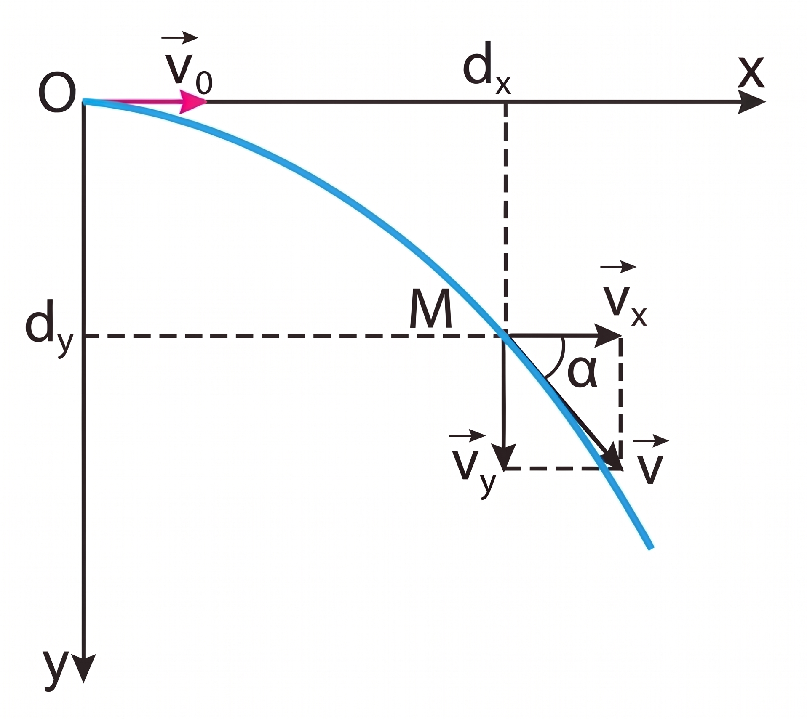{width="70%" fig-align="center"}

Xét theo phương Ox: vật chuyển động thẳng đều nên ta có:

$$
\begin{dcases}
  v_x = v_{0} \\ 
  x = v_x t = v_{0}t \tag{1}
\end{dcases}
$$

Xét theo phương Oy: vật rơi tự do với vận tốc ban đầu bằng 0 nên ta có:

$$
  \begin{dcases}
  v_y = gt \\ 
  y = \frac{1}{2} gt^2 \tag{2}
  \end{dcases}
$$

Từ (1) ta rút ra được $\displaystyle t = \frac{x}{v_{0}}$, thay vào (2):
$$
  y = \frac{1}{2} g \left( \frac{x}{v_{0}} \right)^2 = \frac{g}{2v_{0}^2} x^2
$$
Quỹ đạo chuyển động là một nhánh parabol.

- Thời gian rơi: $\displaystyle H = y = \frac{1}{2}gt^2 \implies t = \sqrt{\frac{2H}{g}}$
- Tầm bay xa của vật theo phương ngang: $\displaystyle L = x_{\max} = v_{0}t = v_{0} \sqrt{\frac{2H}{g}}$
- Vận tốc của vật tại một thời điểm bất kỳ: $v = \sqrt{v_x ^2 + v_y ^2}$
- Phương của vận tốc hợp với phương ngang một góc $\alpha$:
$$
  \tan \alpha = \frac{v_y}{v_x}
$$

::: {.callout}

**Ví dụ 1.** Một mũi tên được phóng đi theo phương ngang từ đỉnh một toà tháp cao 35 m. Vận tốc ban đầu là 30 m/s. Giả sử lực cản không khí là không đang kể. Tính:\
a. Thời gian mũi tên bay đến khi chạm đất.\
b. Khoảng cách từ chân tháp đến nơi mũi tên chạm đất.\
c. Vận tốc của mũi tên khi chạm đất.

::: {.text-center}
**Giải**
:::

Chọn hệ quy chiếu với gốc toạ độ tại đỉnh tháp, trục $Ox$ hướng từ trái sang phải, trục $Oy$ hướng xuống dưới. Ta có:
$$
  \begin{aligned}
    v_x &= v_{0x} = v_0 = 30 \\ 
    v_y &= v_{0y} + at = 9.8 t
  \end{aligned}
$$

Phương trình chuyển động theo các phương Ox, Oy là:
$$
  \begin{aligned}
    x &= x_{0} + v_{0x}t = 30 t \\ 
    y &= y_{0} + v_{0y}t + \frac{at^2}{2} = 4.5 t^2
  \end{aligned}
$$
a\. Mũi tên chạm đất khi $y = 35$ m:
$$ 4.5 t^2 = 35 \quad \text{hay} \quad  t = 2.67 \text{s} $$ 

b\. Khoảng cách từ chân cột đến điểm rơi:
$$ x = 30 t = 30 \times 2.67 = 80.1 ~\text{m} $$

c\. Để tính vận tốc của mũi tên, ta tính vận tốc theo phương Ox và Oy. Ta có $v_x = 30$ m/s, $v_y = 9.8 t = 9.8 \times 2.67 = 26.2$ m/s.

Vận tốc của mũi tên là: $v = \sqrt{v_x ^2 + v_y ^2} = \sqrt{30^2 + 26.2^2} = 39.8$ m/s. Góc của vận tốc so với phương ngang là
$$
  \tan \alpha = \frac{v_y}{v_x} = \frac{26.2}{30} \Rightarrow \alpha = 41^\circ
$$

**Ví dụ 2.** Một vật được ném theo phương ngang từ một con tàu và rơi xuống biển sau 1.6 s ở vị trí cách con tàu 37 m. Tính:\
a\. Vận tốc ban đầu của vật.\
b\. Độ cao ban đầu của vật so với mực nước biển.

::: {.text-center}
**Giải**
:::
Chọn gốc toạ độ tại vị trí ném vật, trục Ox hướng sang phải, trục Oy hướng xuống dưới.\
a. Vật di chuyển 37 m theo chiều ngang trong 1.6 s, vận tốc theo phương ngang là $v = v_x = \frac{37}{1.6} = 23$ m/s.\
b. Phương trình chuyển động của vật theo phương Oy là: $y = y_{0} + v_{0y}t + \frac{at^2}{2} = 4.5 t^2$.

Vật chuyển động trong 1.6 s, nên chiều cao là $y = 4.5 \times 1.6^2 = 12.5$ m.

:::

### Chuyển động ném xiên

Xét một vật được ném xiên từ điểm O trên mặt đất với vận tốc ban đầu $\vec{v}_0$ hợp với phương ngang một góc $\alpha$.

Theo Ox vật chuyển động thẳng đều nên ta có:

$$
\begin{align}
  v_x &= v_{0x} = v_0 \cos \alpha \ x = v_x t = v_0 \cos \alpha \cdot t \\ 
  \Rightarrow t &= \dfrac{x}{v_0 \cos \alpha} \quad (1)
\end{align}
$$

Theo Oy vật chuyển động thẳng biến đổi đều với gia tốc $-\vec{g}$:

$$
  \begin{cases}
    v_{0y} = v_0 \sin \alpha \ v_y = v_{0y} - gt = v_0 \sin \alpha - gt \\
    y = v_{0y} t - \dfrac{1}{2}gt^2 = v_0 \sin \alpha \cdot t - \dfrac{1}{2}gt^2 \quad (2)
  \end{cases}
$$

Thay (1) vào (2) ta được:

$$y = v_0 \sin \alpha \cdot \frac{x}{v_0 \cos \alpha} - \frac{1}{2}g \left(\frac{x}{v_0 \cos \alpha}\right)^2 = -\frac{g}{2v_0^2 \cos^2 \alpha} x^2 + x \cdot \tan \alpha$$

$\Rightarrow$ Quỹ đạo là Parabol.

**Thời gian từ lúc ném đến khi vật rơi chạm đất:** khi chạm đất $y = 0$ từ (2) ta có:

$$t = \frac{2v_0 \sin \alpha}{g}$$

**Tầm bay xa theo phương ngang:**

$$L = x_{\text{max}} = v_0 \cos \alpha \cdot \frac{2v_0 \sin \alpha}{g} = \frac{v_0^2 \sin 2\alpha}{g}$$

**Tầm bay cao:**

$$H = y_{\text{max}} = \frac{v_0^2 \sin^2 \alpha}{2g}$$

## Tính tương đối của chuyển động - Công thức cộng vận tốc

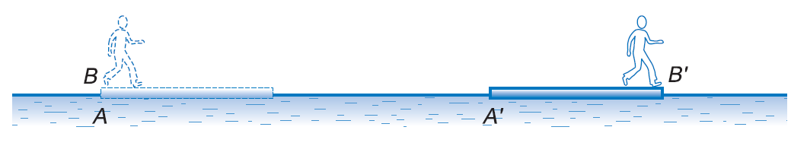

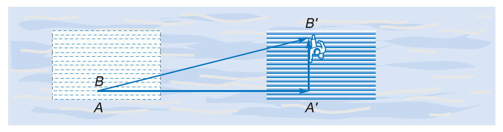

Ta có:

- $\overrightarrow{AB^{\prime}}$ là độ dời của người đối với bờ, là độ dời tuyệt đối.
- $\overrightarrow{A^{\prime} B^{\prime} }$ là độ dời của người đối với bè, là độ dời tương đối.
- $\overrightarrow{AA^{\prime} }$ là độ dời của bè đối với bờ, là độ dời kéo theo.

Độ dời của người đối với bờ là:
$$
  \overrightarrow{AB^{\prime} } = \overrightarrow{AA^{\prime} } + \overrightarrow{A^{\prime} B^{\prime} }
$$
Chia cả hai vế cho $\Delta t$, ta được:
$$ \vec{v}_{1,3} = \vec{v}_{1,2} + \vec{v}_{2,3} $$
trong đó

- $\vec{v}_{1,3}$ là vận tốc của người so với bờ, là vận tốc tuyệt đối.
- $\vec{v}_{1,2}$ là vận tốc của bè so với bờ, là vận tốc tương đối.
- $\vec{v}_{2,3}$ là vận tốc của người so với bè, là vận tốc kéo theo.

## Bài tập minh họa {.unnumbered}

#### Dạng 1. Chuyển động thẳng đều {.unnumbered}

**Bài 1.** Một ô tô chuyển động thẳng đều với vận tốc 95 km/h trên đường quốc lộ song song với đường ray của một tàu hỏa đang chuyển động thẳng đều với vận tốc 75 km/h. Ô tô và tàu hỏa chuyển động cùng chiều. Biết chiều dài của tàu hỏa là 1.3 km. Hỏi sau bao lâu thì ô tô vượt qua hết chiều dài tàu hỏa và quãng đường ô tô đi được trong thời gian đó. Kết quả bài toán sẽ ra sao nếu ô tô và tàu hỏa đi ngược chiều.

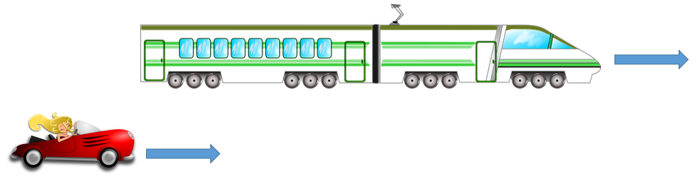{width="70%" fig-align="center"}

**Bài 2.** Lúc 7 giờ sáng một xe ô tô xuất phát ưừ tỉnh A đi đến tỉnh B với tốc độ 60 km/h. Nửa giờ sau, một ô tô khác xuất phát từ tỉnh B đi đến tỉnh A với tốc độ 40 km/h. Coi đường đi giữa hai tỉnh A và B là đường thẳng, cách nhau 180 km và các ô tô chuyển động thằng đều.

1.  Lập phương trình chuyển động của các xe ô tô.
2.  Xác định vị trí và thời điểm hai xe gặp nhau.
3.  Xác định các thời điểm mà các xe đi đến nơi đã định.

#### Dạng 2. Tính tốc độ trung bình {.unnumbered}

**Bài 3.** Một người tập thể dục chạy trên một đường thẳng. Lúc đầu người đó chạy với tốc độ trung bình 5 m/s trong thời gian 4 phút. Sau đó người đó giảm tốc độ xuống còn 4 m/s trong thời gian 3 phút.

1.  Hỏi người đó chạy đường quãng đường bằng bao nhiêu?
2.  Tính tốc độ trung bình của người đó trong toàn bộ thời chạy.

#### Dạng 3. Chuyển động biến đổi đều {.unnumbered}

**Bài 1.** Sau khi khởi hành được 50 m, xe đạt vận tốc 5 m/s. Hỏi sau khi đi hết 50 m tiếp theo xe có vận tốc là bao nhiêu? Biết xe chuyển động nhanh dần đều.

**Bài 2.** Từ trạng thái đứng yên, một vật chuyển động nhanh dần đều với gia tốc 2 m/s^2^ và đi được quãng đường dài 100 m. Hãy chia quãng đường đó ra làm hai phần bằng nhau sao cho vật đi được hai phần đó trong hai khoảng thời gian bằng nhau.

**Bài 3.** Một đoàn tàu khi cách ga 50 m thì bắt đầu hãm phanh. Sau thời gian 10s tàu dừng tại ga. Hỏi vận tốc đoàn tàu khi bắt đầu hãm phanh và gia tốc đoàn tàu.

**Bài 4.** Một quả cầu bắt đầu lăn từ đỉnh dốc dài 100 m, sau 10s thì nó đến chân dốc. Sau đó nó tiếp tục chuyển động trên mặt ngang được 50 m thì dừng lại. Tìm thời gian chuyển động của quả cầu? Biết chuyển động lăn là trên dốc là chuyển động nhanh dần đều, chuyển động trên mặt phẳng ngang là chuyển động chậm dần đều.

**Bài 5.** Một vật chuyển động thẳng biến đổi đều với vận tốc ban đầu $v_{0} = 2$ m/s. Quãng đường vật đi được trong giây thứ 3 là 4.5 m. Tìm quãng đường vật đi được trong giây thứ 4.

**Bài 6.** Vật chuyển động có phương trình chuyển động là $x = 10 - 20t +t^2$ (m, s)\
a. Xác định $v_{0}, a$ và tính chất chuyển động của vật.\
b. Tính thời gian mà vật đi được quãng đường 50 m kể từ $t= 0$.

**Bài 7.** Hai người đi xe đạp khởi hành cùng một lúc từ hai điểm A và B và chuyển động ngược chiều nhau. Từ A người thứ nhất lên dốc có vận tốc ban đầu là 18 km/h lên dốc chậm dần đều với gia tốc là 0.2 m/s^2^. Từ B người thứ hai xuống dốc với vận tốc ban đầu là 5.4 km/h và chuyển động nhanh dần đều với gia tốc là $0.2$ m/s^2^. A, B cách nhau $130$ m. Tìm xem sau bao lâu thì hai người gặp nhau và đến lúc gặp nhau mỗi người đã đi được quãng đường dài bao nhiêu?

**Bài 8.** Một đoàn tàu dài $75\text{ m}$ bắt đầu tăng tốc chuyển động thẳng nhanh dần đều từ trạng thái nghỉ. Khi đầu tàu đi ngang qua một công nhân đường sắt đứng cách vị trí nó xuất phát $180\text{ m}$ thì đầu tàu có vận tốc $18\text{ m/s}$. Tính vận tốc của đoàn tàu khi nó vượt qua người công nhân, thời gian để tàu vượt qua người công nhân.

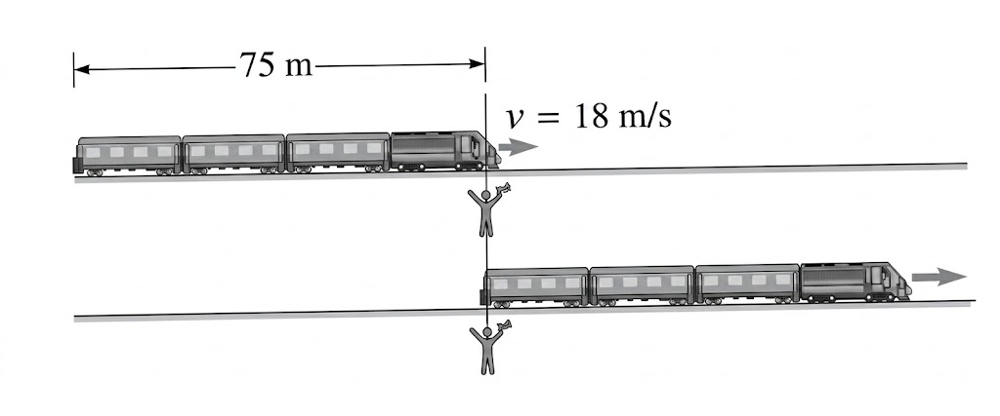{fig-align="center" width="50%"}

**Bài 9.** Một quả bóng chày được ném ra từ tay một vận động viên với vận tốc $43\text{ m/s}$. Biết quả bóng được tăng tốc từ trạng thái nghỉ và di chuyển một đoạn khoảng $3.5\text{ m}$ trước khi rời khỏi tay vận động viên. Tính gia tốc trung bình của quả bóng chày.

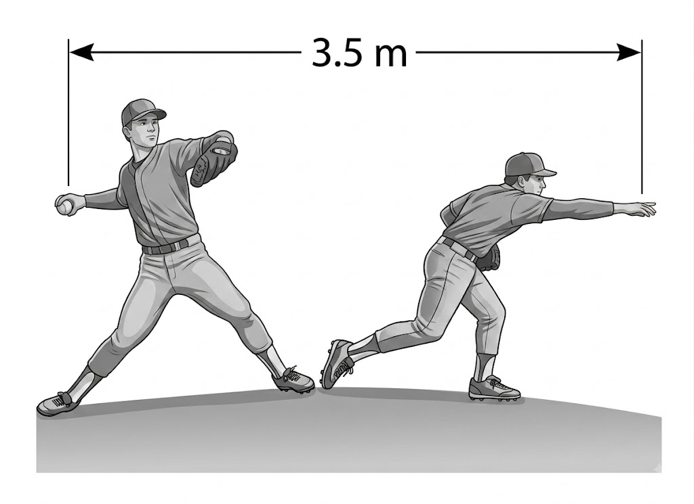{fig-align="center" width="50%"}

**Bài 10.** An và Tâm đang thi chạy bộ. Khi An còn cách vạch đích $22\text{ m}$ thì cô ấy có vận tốc tức thời là $4.0\text{ m/s}$ và ở sau Tâm $5.0\text{ m}$, khi đó Tâm có vận tốc tức thời $5.0\text{ m/s}$. Tâm nghĩ rằng cô dễ dàng chiến thắng An nên trong chặng đường còn lại Tâm chuyển động chậm dần đều với gia tốc $0.4\text{ m/s}^2$. An phải tăng tốc nhanh dần đều với gia tốc là bao nhiêu để có thể đến vạch đích cùng lúc với Tâm.

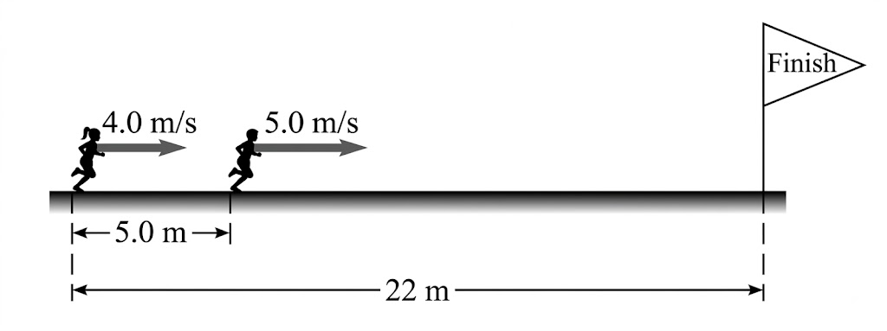{fig-align="center" width="50%"}

**Bài 11.** Một ô tô bắt đầu chuyển động thẳng từ trạng thái nghỉ với gia tốc $2\text{ m/s}^2$. Sau bao lâu ô tô đi được quãng đường $30\text{ m}$.

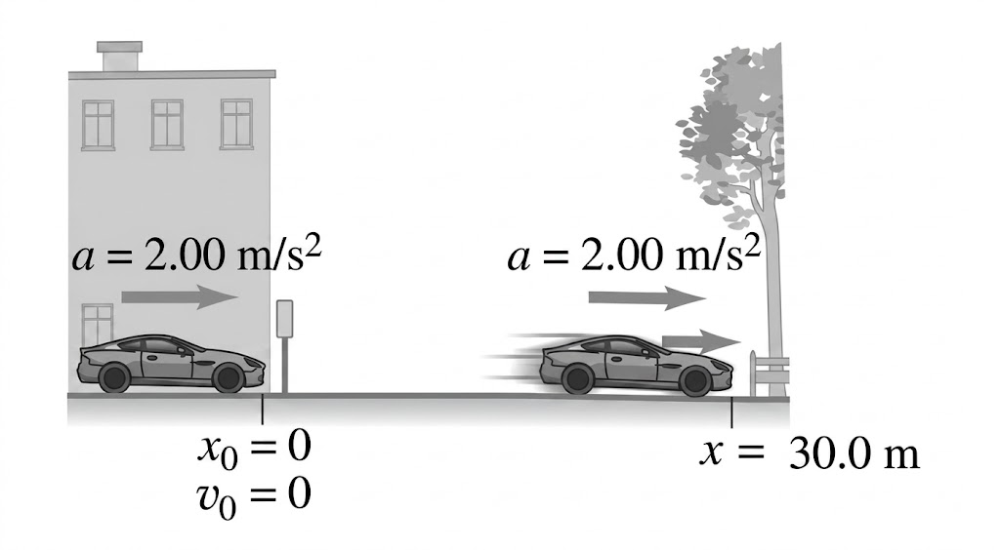{fig-align="center" width="50%"}

#### Dạng 4. Rơi tự do {.unnumbered}

**Bài 1.** Một vật được thả rơi tự do từ độ cao 10 m. Lấy $g = 10$ m/s^2^.\
a. Tìm thời gian để vật rơi đến đất.\
b. Tìm tốc độ lúc vật chạm đất.\
c. Sau khi rơi được 0.5s thì vật còn cách mặt đất bao xa.

**Bài 2.** Một vật được thả rơi tự do, khi chạm đất đạt tốc độ 30 m/s. Lấy $g = 10$ m/s^2^.\
a. Tìm thời gian rơi của vật.\
b. Tính độ cao lúc thả vật.\
c. Khi tốc độ rơi của vật là 20 m/s thì vật còn cách đất bao nhiêu và sau bao lâu thì vật rơi đến mặt đất.

**Bài 3.** Một hòn đá rơi từ miệng một cái giếng cạn xuống đến đáy giếng mất 2.5s. Lấy $g = 10$ m/s^2^.\
a. Tính độ sâu của giếng và tốc độ của hòn đá khi vừa chạm đáy giếng.\
b. Tính quãng đường hòn đá rơi trong giây thứ 2.

**Bài 4.** Một vật rơi tự do, trong giây cuối cùng rơi được quãng đường 45m. Lấy $g = 10$ m/s^2^. Tính thời gian rơi và độ cao của vật rơi.

**Bài 5.** Từ đỉnh một tháp người ta thả rơi một vật. Một giây sau ở tầng thấp hơn 10m người ta buông rơi vật thứ 2. Hai vật chạm đất cùng một lúc. Tính thời gian rơi của vật thứ nhất. Lấy $g = 10$ m/s^2^.

**Bài 6.** Trong 2s cuối cùng trước khi chạm đất, một vật rơi tự do đi được quãng đường bằng 16/25 quãng đường toàn bộ mà nói rơi được. Tìm thời gian rơi và độ cao ban đầu của vật. Cho $g = 10$ m/s^2^.

#### Dạng 5. Chuyển động của vật bị ném {.unnumbered}

**Bài 1.** Từ độ cao H = 10 m, người ta ném một vật lên cao theo phương thẳng đứng với vận tốc $v_{0} = 20$ m/s. Lấy $g = 10$ m/s^2^. Tính:\
a. Thời gian để vật lên đến độ cao cực đại và độ cao cực đại đó.\
b. Vận tốc của vật khi rơi đến mặt đất và thời gian từ lúc ném vật đến lúc rơi đến đất. 

**Bài 2.** Hai vật được ném thẳng đứng lên cao từ cùng một điểm với $v_{0} = 25$ m/s, vật II sau vật I khoảng thời gian $t_{0} = 0.5$ s. Lấy $g = 10$ m/s^2^.\
a. Hỏi hai vật gặp nhau sau khi ném vật II bao lâu và ở độ cao nào?\
b. Tìm điều kiện của $t_{0}$ để hai vật có thể gặp nhau?

**Bài 3.** Một vật được ném theo phương ngang, sau thời gian $0.5$ s vật rơi cách vị trí ném 5 m. Tìm:\
a. Độ cao của nơi ném vật.\
b. Vật tốc lúc ném vật.\
c. Vận tốc khi vật chạm đất.\
d. Góc hợp bởi phương vận tốc và phương ngang sau khi ném 0.2 s. Lấy $g = 10$ m/s^2^.

**Bài 4.** Một hòn đá được ném từ độ cao $2.1$ m so với mặt đất với góc ném $\alpha = 45^\circ$ so với phương ngang. Hòn đá rơi đến cách chỗ ném theo phương ngang một khoảng 42 m. Tìm:\
a. Vật tốc của hòn đá khi ném.\
b. Thời gian hòn đá rơi.\
c. Độ cao lớn nhất mà hòn đá đạt đến. Lấy $g = 9.8$ m/s^2^.

#### Dạng 6. Công thức cộng vận tốc {.unnumbered}


