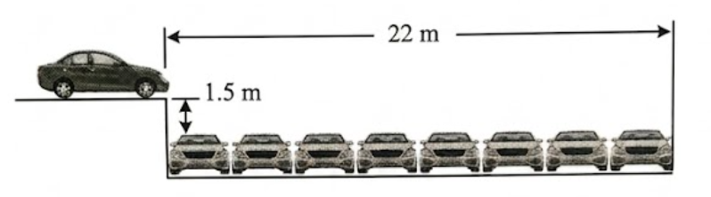
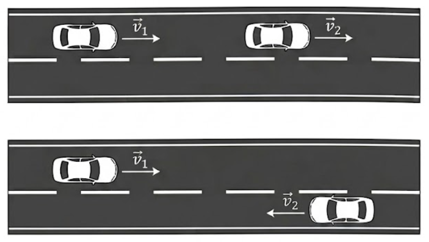
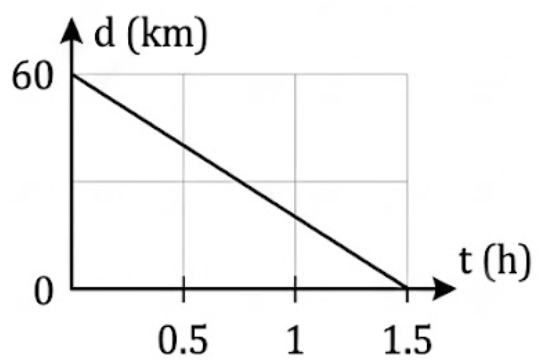

# Động học

## Độ dịch chuyển và quãng đường đi được

**Vị trí của vật chuyển động tại các thời điểm:**

Để xác định vị trí của vật chuyển động tại các thời điểm ta chọn một hệ tọa độ gắn với vật làm mốc, một mốc thời gian và đồng hồ đo thời gian, gọi là ***hệ quy chiếu***.

Nếu vật chuyển động trên một đường thẳng, để khảo sát vị trí của vật ta chỉ cần chọn một trục Ox trùng với quỹ đạo của vật.

{width="70%" fig-align="center"}

Nếu vật chuyển động trong một mặt phẳng, để khảo sát vị trí của vật ta chọn hai trục Ox, Oy vuông góc nhau.

{width="50%" fig-align="center"}

**Độ dịch chuyển:**

Độ dịch chuyển là một vectơ cho biết độ dài, phương và hướng của sự thay đổi vị trí của vật. Kí hiệu là $\vec{d}$.

Vật đi từ A đến B rồi đi từ B đến C thì độ dịch chuyển là vector \$\vec{d} = \overrightarrow{AC} \$.

*(Sơ đồ minh họa: Vật di chuyển từ* $A \rightarrow B \rightarrow C$, độ dịch chuyển tổng hợp là $\vec{d} = \vec{AC}$)

**Độ dịch chuyển và quãng đường:** Chỉ khi vật chuyển động thẳng theo một chiều (không đổi chiều) thì độ lớn của độ dịch chuyển bằng với quãng đường đi được của vật. Còn các trường hợp còn lại thì độ dịch chuyển và quãng đường là khác nhau.

**Tổng hợp độ dịch chuyển:** Độ dịch chuyển là đại lượng vectơ nên khi tổng hợp độ dịch chuyển sẽ tuân theo quy tắc cộng vectơ (quy tắc hình bình hành). Trong ví dụ trên ta có: $\vec{d} = \overrightarrow{AB} + \overrightarrow{BC}$

## Tốc độ và vận tốc

**Tốc độ:** Đặc trưng cho sự nhanh hay chậm của chuyển động của vật.

-   Tốc độ trung bình: $\displaystyle \vert v \vert = \frac{s}{t}$ hay $\displaystyle \vert v \vert = \frac{\Delta s}{\Delta t}$
-   Tốc độ tức thời là tốc độ tại một thời điểm xác định.
-   Đơn vị của tốc độ: m/s ; km/h ; ...

*(Chú thích hình: Tốc kế chỉ tốc độ tức thời của xe)*

**Vận tốc:** Đặc trưng cho sự nhanh hay chậm và phương chiều của chuyển động của vật, vận tốc là đại lượng vectơ.

-   Vận tốc trung bình: $\displaystyle \vec{v} = \frac{\vec{d}}{t}$ hay $\displaystyle \vec{v} = \frac{\Delta \vec{d}}{\Delta t}$
-   Vận tốc tức thời là vận tốc tại một thời điểm xác định.
-   Đơn vị của vận tốc: m/s ; km/h ; ...

**Công thức cộng vận tốc:** $\vec{v}_{1,3} = \vec{v}_{1,2} + \vec{v}_{2,3}$ \\ (vận tốc là đại lượng vectơ nên cộng vận tốc phải theo quy tắc cộng vectơ, quy tắc hình bình hành).

*(Chú thích hình: Người ngồi trong ô tô đang chuyển động thấy giọt mưa rơi xiên)*

## Chuyển động thẳng đều

Chuyển động thẳng đều là chuyển động có quỹ đạo là đường thẳng và đi được những quãng đường bằng nhau trong những khoảng thời gian như nhau. Trong chuyển động thẳng đều, vận tốc là đại lượng không đổi.

$$ v = \frac{\Delta d}{\Delta t} $$

-   $v$ là vận tốc ($\text{km/h}, \text{m/s}$)
-   $d$ là độ dịch chuyển ($\text{km}, \text{m}$)
-   $t$ là thời gian chuyển động ($\text{h}, \text{s}$)

**Phương trình chuyển động thẳng đều:** Ta có: $\displaystyle v = \frac{\Delta d}{\Delta t} = \frac{x - x_0}{t - 0}$ $\implies x = x_0 + v \cdot t$

*Trong đó:*

-   $x_0$ là tọa độ của vật tại thời điểm ban đầu $t = 0$.
-   $x$ là tọa độ tại thời điểm $t$ sau đó.

**Đồ thị vận tốc theo thời gian:**

{width="70%" fig-align="center"}

Quãng đường: \$s = v \cdot t = \$ diện tích hình chữ nhật

**Đồ thị độ dịch chuyển – thời gian:**

-   Từ $\displaystyle v = \frac{d}{t} \implies d = v \cdot t$ ta có đồ thị có dạng sau:
-   Độ dốc của đồ thị bằng với vận tốc của vật: $\tan \alpha = v$

{#fig-particle-position width="70%" fig-align="center"}

## Chuyển động thẳng biến đổi đều

Chuyển động có vận tốc thay đổi theo thời gian được gọi là chuyển động biến đổi.

**Gia tốc** là đại lượng đặc trưng cho sự biến đổi nhanh hay chậm của vận tốc.

*Gia tốc trung bình* được tính công thức: $$\vec{a}_{tb} = \frac{\vec{v}_t - \vec{v}_0}{t - t_0} = \frac{\Delta \vec{v}}{\Delta t}$$

Vector gia tốc trung bình có cùng phương với quỹ đạo, giá trị đại số của nó là:
$$ a_{tb} = \frac{v_t - v_0}{t - t_0} = \frac{\Delta v}{\Delta t} $$

Trong phần này ta chỉ tìm hiểu chuyển động biến đổi đơn giản nhất là chuyển động thẳng biến đổi đều. **Chuyển động thẳng biến đổi đều** là chuyển động thẳng và vectơ gia tốc không đổi theo thời gian.

- Nếu vận tốc tăng đều theo thời gian: Chuyển động thẳng nhanh dần đều.
- Nếu vận tốc giảm đều theo thời gian: Chuyển động thẳng chậm dần đều.

> *Lưu ý:*
>
> - Chuyển động thẳng nhanh dần đều: $\vec{a}$ và $\vec{v}$ cùng chiều hay $a$ và $v$ cùng dấu $(a \cdot v > 0)$.
> - Chuyển động thẳng chậm dần đều: $\vec{a}$ và $\vec{v}$ ngược chiều hay $a$ và $v$ ngược dấu $(a \cdot v < 0)$.
> - Đơn vị của gia tốc là: m/s^2^.

Các phương trình của chuyển động thẳng biến đổi điều (suvat):
$$
  \begin{align}
    v & = v_{0} + at    \tag{1} \\
    d & = \frac{v + v_{0}}{2}t    \tag{2} \\
    d & = v_{0}t + \frac{at^2}{2}    \tag{3} \\
    v^2 - v_{0}^2 &= 2ad     \tag{4}
  \end{align}
$$

{width="75%" fig-align="center"}

Phương trình (3) của chuyển động biến đổi đều có thể viết đầy đủ như sau:
$$ x = x_{0} + v_{0}t + \frac{at^2}{2} $$

## Rơi tự do

::: {.callout title="Định nghĩa"}
Rơi tự do là sự rơi của một vật chỉ chịu tác động của trọng lực
:::

Khi không có lực cản không khí, các vật có hình dạng và khối lượng khác nhau đều rơi như nhau, ta bảo rằng chúng rơi tự do.

- Khi hòn đá rơi, lực cản không khí tác động lên nó là không đáng kể so với trọng lượng của nó. Ta có thể cho hòn đá là rơi tự do.
- Khi lông chim rơi, lực cản không khí là lớn đáng kể so với trọng lượng của nó. Lông chim không rơi tự do.

Chuyển động rơi tự do là chuyển động thẳng nhanh dần đều, phương thẳng đứng và có chiều từ trên xuống dưới.

**Gia tốc rơi tự do:** Ở cùng một nơi trên Trái Đất và ở gần mặt đất, các vật rơi tự do đều có cùng một gia tốc $g$.

- Giá trị của $g$ thường được lấy là $9.8$ m/s^2^.
- Gia tốc $\vec{g}$ luôn có phương thẳng đứng, chiều hướng từ trên xuống.

Vì chuyển động rơi tự do là chuyển động biến đổi đều, nên các các công thức của chuyển động biến đổi đều có thể áp dụng khi vật rơi tự do.

## Chuyển động ném

### Chuyển động ném ngang

Xét một vật được ném ngang từ điểm O ở độ cao H so với mặt đất. Chọn hệ quy chiếu như hình vẽ.

**Xét theo phương Ox:** vật chuyển động thẳng đều nên ta có:

$$v_x = v_0 \ x = v_x t = v_0 t \Rightarrow t = \dfrac{x}{v_0} \quad (1) $$

**Xét theo phương Oy:** vật rơi tự do với vận tốc ban đầu bằng 0 nên ta có:

$$v_y = gt \ y = \dfrac{1}{2}gt^2 \quad (2) $$

**Thay (1) vào (2) ta được:** $y = \dfrac{1}{2}g \left(\dfrac{x}{v_0}\right)^2 = \dfrac{g}{2v_0^2} \cdot x^2$.

$\implies$ Quỹ đạo chuyển động của vật là một nhánh Parabol.

**Thời gian rơi:** $$y = H = \frac{1}{2}gt^2 \Rightarrow t = \sqrt{\frac{2H}{g}}$$

**Tầm bay xa của vật theo phương ngang:**

$$L = x_{\text{max}} = v_0 t = v_0 \sqrt{\frac{2H}{g}}$$

**Vận tốc của vật khi chạm đất:**

$$v_{\text{cđ}} = \sqrt{v_x^2 + v_y^2} = \sqrt{v_0^2 + 2gH}$$

### Chuyển động ném xiên

Xét một vật được ném xiên từ điểm O trên mặt đất với vận tốc ban đầu $\vec{v}_0$ hợp với phương ngang một góc $\alpha$.

Theo Ox vật chuyển động thẳng đều nên ta có:

$$
\begin{align}
  v_x &= v_{0x} = v_0 \cos \alpha \ x = v_x t = v_0 \cos \alpha \cdot t \\ 
  \Rightarrow t &= \dfrac{x}{v_0 \cos \alpha} \quad (1)
\end{align}
$$

Theo Oy vật chuyển động thẳng biến đổi đều với gia tốc $-\vec{g}$:

$$
  \begin{cases}
    v_{0y} = v_0 \sin \alpha \ v_y = v_{0y} - gt = v_0 \sin \alpha - gt \\
    y = v_{0y} t - \dfrac{1}{2}gt^2 = v_0 \sin \alpha \cdot t - \dfrac{1}{2}gt^2 \quad (2)
  \end{cases}
$$

Thay (1) vào (2) ta được:

$$y = v_0 \sin \alpha \cdot \frac{x}{v_0 \cos \alpha} - \frac{1}{2}g \left(\frac{x}{v_0 \cos \alpha}\right)^2 = -\frac{g}{2v_0^2 \cos^2 \alpha} x^2 + x \cdot \tan \alpha$$

$\Rightarrow$ Quỹ đạo là Parabol.

**Thời gian từ lúc ném đến khi vật rơi chạm đất:** khi chạm đất $y = 0$ từ (2) ta có:

$$t = \frac{2v_0 \sin \alpha}{g}$$

**Tầm bay xa theo phương ngang:**

$$L = x_{\text{max}} = v_0 \cos \alpha \cdot \frac{2v_0 \sin \alpha}{g} = \frac{v_0^2 \sin 2\alpha}{g}$$

**Tầm bay cao:**

$$H = y_{\text{max}} = \frac{v_0^2 \sin^2 \alpha}{2g}$$

## Tính tương đối của chuyển động - Công thức cộng vận tốc

Ta có:

- $\overrightarrow{AB^{\prime}}$ là độ dời của người đối với bờ, là độ dời tuyệt đối.
- $\overrightarrow{A^{\prime} B^{\prime} }$ là độ dời của người đối với bè, là độ dời tương đối.
- $\overrightarrow{AA^{\prime} }$ là độ dời của bè đối với bờ, là độ dời kéo theo.

Độ dời của người đối với bờ là:
$$
  \overrightarrow{AB^{\prime} } = \overrightarrow{AA^{\prime} } + \overrightarrow{A^{\prime} B^{\prime} }
$$
Chia cả hai vế cho $\Delta t$, ta được:
$$ \vec{v}_{1,3} = \vec{v}_{1,2} + \vec{v}_{2,3} $$
trong đó

- $\vec{v}_{1,3}$ là vận tốc của người so với bờ, là vận tốc tuyệt đối.
- $\vec{v}_{1,2}$ là vận tốc của bè so với bờ, là vận tốc tương đối.
- $\vec{v}_{2,3}$ là vận tốc của người so với bè, là vận tốc kéo theo.

## Bài tập minh họa {.unnumbered}

**Dạng 1. Chuyển động thẳng đều**

**Bài 1.** Một ô tô chuyển động thẳng đều với vận tốc 95 km/h trên đường quốc lộ song song với đường ray của một tàu hỏa đang chuyển động thẳng đều với vận tốc 75 km/h. Ô tô và tàu hỏa chuyển động cùng chiều. Biết chiều dài của tàu hỏa là 1.3 km. Hỏi sau bao lâu thì ô tô vượt qua hết chiều dài tàu hỏa và quãng đường ô tô đi được trong thời gian đó. Kết quả bài toán sẽ ra sao nếu ô tô và tàu hỏa đi ngược chiều.

{width="70%" fig-align="center"}

**Bài 2.** Lúc 7 giờ sáng một xe ô tô xuất phát ưừ tỉnh A đi đến tỉnh B với tốc độ 60 km/h. Nửa giờ sau, một ô tô khác xuất phát từ tỉnh B đi đến tỉnh A với tốc độ 40 km/h. Coi đường đi giữa hai tỉnh A và B là đường thẳng, cách nhau 180 km và các ô tô chuyển động thằng đều.

1.  Lập phương trình chuyển động của các xe ô tô.
2.  Xác định vị trí và thời điểm hai xe gặp nhau.
3.  Xác định các thời điểm mà các xe đi đến nơi đã định.

**Dạng 2. Tính tốc độ trung bình**

**Bài 3.** Một người tập thể dục chạy trên một đường thẳng. Lúc đầu người đó chạy với tốc độ trung bình 5 m/s trong thời gian 4 phút. Sau đó người đó giảm tốc độ xuống còn 4 m/s trong thời gian 3 phút.

1.  Hỏi người đó chạy đường quãng đường bằng bao nhiêu?
2.  Tính tốc độ trung bình của người đó trong toàn bộ thời chạy.

**Dạng 3. Chuyển động biến đổi đều**

**Bài 1.** Sau khi khởi hành được 50 m, xe đạt vận tốc 5 m/s. Hỏi sau khi đi hết 50 m tiếp theo xe có vận tốc là bao nhiêu? Biết xe chuyển động nhanh dần đều.

**Bài 2.** Từ trạng thái đứng yên, một vật chuyển động nhanh dần đều với gia tốc 2 m/s^2^ và đi được quãng đường dài 100 m. Hãy chia quãng đường đó ra làm hai phần bằng nhau sao cho vật đi được hai phần đó trong hai khoảng thời gian bằng nhau.

**Bài 3.** Một đoàn tàu khi cách ga 50 m thì bắt đầu hãm phanh. Sau thời gian 10s tàu dừng tại ga. Hỏi vận tốc đoàn tàu khi bắt đầu hãm phanh và gia tốc đoàn tàu.

**Bài 4.** Một quả cầu bắt đầu lăn từ đỉnh dốc dài 100 m, sau 10s thì nó đến chân dốc. Sau đó nó tiếp tục chuyển động trên mặt ngang được 50 m thì dừng lại. Tìm thời gian chuyển động của quả cầu? Biết chuyển động lăn là trên dốc là chuyển động nhanh dần đều, chuyển động trên mặt phẳng ngang là chuyển động chậm dần đều.

**Bài 5.** Một vật chuyển động thẳng biến đổi đều với vận tốc ban đầu $v_{0} = 2$ m/s. Quãng đường vật đi được trong giây thứ 3 là 4.5 m. Tìm quãng đường vật đi được trong giây thứ 4.

**Bài 6.** Vật chuyển động có phương trình chuyển động là $x = 10 - 20t +t^2$ (m, s)\
a. Xác định $v_{0}, a$ và tính chất chuyển động của vật.\
b. Tính thời gian mà vật đi được quãng đường 50 m kể từ $t= 0$.

**Bài 7.** Hai người đi xe đạp khởi hành cùng một lúc từ hai điểm A và B và chuyển động ngược chiều nhau. Từ A người thứ nhất lên dốc có vận tốc ban đầu là 18 km/h lên dốc chậm dần đều với gia tốc là 0.2 m/s^2^. Từ B người thứ hai xuống dốc với vận tốc ban đầu là 5.4 km/h và chuyển động nhanh dần đều với gia tốc là $0.2$ m/s^2^. A, B cách nhau $130$ m. Tìm xem sau bao lâu thì hai người gặp nhau và đến lúc gặp nhau mỗi người đã đi được quãng đường dài bao nhiêu?

**Bài 8.** Một đoàn tàu dài $75\text{ m}$ bắt đầu tăng tốc chuyển động thẳng nhanh dần đều từ trạng thái nghỉ. Khi đầu tàu đi ngang qua một công nhân đường sắt đứng cách vị trí nó xuất phát $180\text{ m}$ thì đầu tàu có vận tốc $18\text{ m/s}$. Tính vận tốc của đoàn tàu khi nó vượt qua người công nhân, thời gian để tàu vượt qua người công nhân.

{fig-align="center" width="50%"}

**Bài 9.** Một quả bóng chày được ném ra từ tay một vận động viên với vận tốc $43\text{ m/s}$. Biết quả bóng được tăng tốc từ trạng thái nghỉ và di chuyển một đoạn khoảng $3.5\text{ m}$ trước khi rời khỏi tay vận động viên. Tính gia tốc trung bình của quả bóng chày.

{fig-align="center" width="50%"}

**Bài 10.** An và Tâm đang thi chạy bộ. Khi An còn cách vạch đích $22\text{ m}$ thì cô ấy có vận tốc tức thời là $4.0\text{ m/s}$ và ở sau Tâm $5.0\text{ m}$, khi đó Tâm có vận tốc tức thời $5.0\text{ m/s}$. Tâm nghĩ rằng cô dễ dàng chiến thắng An nên trong chặng đường còn lại Tâm chuyển động chậm dần đều với gia tốc $0.4\text{ m/s}^2$. An phải tăng tốc nhanh dần đều với gia tốc là bao nhiêu để có thể đến vạch đích cùng lúc với Tâm.

{fig-align="center" width="50%"}

**Bài 11.** Một ô tô bắt đầu chuyển động thẳng từ trạng thái nghỉ với gia tốc $2\text{ m/s}^2$. Sau bao lâu ô tô đi được quãng đường $30\text{ m}$.

{fig-align="center" width="50%"}

**Dạng 4. Rơi tự do**

**Bài 1.** Một vật được thả rơi tự do từ độ cao 10 m. Lấy $g = 10$ m/s^2^.\
a. Tìm thời gian để vật rơi đến đất.\
b. Tìm tốc độ lúc vật chạm đất.\
c. Sau khi rơi được 0.5s thì vật còn cách mặt đất bao xa.

**Bài 2.** Một vật được thả rơi tự do, khi chạm đất đạt tốc độ 30 m/s. Lấy $g = 10$ m/s^2^.\
a. Tìm thời gian rơi của vật.\
b. Tính độ cao lúc thả vật.\
c. Khi tốc độ rơi của vật là 20 m/s thì vật còn cách đất bao nhiêu và sau bao lâu thì vật rơi đến mặt đất.

**Bài 3.** Một hòn đá rơi từ miệng một cái giếng cạn xuống đến đáy giếng mất 2.5s. Lấy $g = 10$ m/s^2^.\
a. Tính độ sâu của giếng và tốc độ của hòn đá khi vừa chạm đáy giếng.\
b. Tính quãng đường hòn đá rơi trong giây thứ 2.

**Bài 4.** Một vật rơi tự do, trong giây cuối cùng rơi được quãng đường 45m. Lấy $g = 10$ m/s^2^. Tính thời gian rơi và độ cao của vật rơi.

**Bài 5.** Từ đỉnh một tháp người ta thả rơi một vật. Một giây sau ở tầng thấp hơn 10m người ta buông rơi vật thứ 2. Hai vật chạm đất cùng một lúc. Tính thời gian rơi của vật thứ nhất. Lấy $g = 10$ m/s^2^.

**Bài 6.** Trong 2s cuối cùng trước khi chạm đất, một vật rơi tự do đi được quãng đường bằng 16/25 quãng đường toàn bộ mà nói rơi được. Tìm thời gian rơi và độ cao ban đầu của vật. Cho $g = 10$ m/s^2^.

**Dạng 5. Chuyển động của vật bị ném**

**Dạng 6. Công thức cộng vận tốc**

## Bài tập tự luyện {.unnumbered}
**Chuyển động đều**

**Bài 1-4/** Từ B lúc 8 h, một người đi về C, chuyển động thẳng đều với tốc độ $v = 60$ km/h.\
a. Viết phương trình tọa độ và xác định vị trí người này lúc 10 giờ.\
b. Biết $\text{BC} = 270$ km. Dùng phương trình tọa độ xác định thời điểm người ấy đến C.

**Bài 2-4/** Hai người cùng một lúc đi bộ từ hai địa điểm A và B để đi đến điểm C cách A $7.2$ km và cách B $6$ km, với tốc độ lần lượt là $20$ km/h và $15$ km/h. Biết A, B, C trên cùng một đường thẳng.\
a. Lập phương trình tọa độ của hai người với cùng một gốc thời gian và chọn gốc tọa độ tại A, chiều dương từ A $\rightarrow$ B.\
b. Hai người có gặp nhau terước khi đến C hay không?\
(*Gợi ý:* Chia làm 2 trường hợp.)

**Bài 3-4/** Cùng một lúc từ hai địa điểm A và B cách nhau $30$ km có hai xe chạy cùng chiều nhau theo hướng từ A đến B, sau $2.5$ giờ thì đuổi kịp nhau. Biết xe đi từ A có tốc độ không đổi là $45$ km/h. Tính tốc độ của xe đi từ B.

**Bài 4-4/** Lúc 8 h có một xe xuất phát từ A đi về B với vận tốc $40$ km/h. Lúc 8h20’ một xe khác xuất phát từ B đi về A với vận tốc $60$ km/h. Cho $\text{AB} = 120$ km.\
a. Tìm khoảng cách hai xe lúc 9 giờ.\
b. Hai xe gặp nhau lúc mấy giờ? Ở đâu?\
c. Các xe về đến B và A lúc mấy giờ ?

**Bài 5-4/** Lúc 8 giờ một người đi xe đạp với vận tốc $12$ km/h gặp một người đi bộ đi ngược chiều với vận tốc $4$ km/h trên cùng một đường thẳng. Tới 8 giờ 30 phút người đi xe đạp dừng lại, nghỉ lại 30 phút rồi quay trở lại đuổi theo người đi bộ với vận tốc có độ lớn như trước. Xác định lúc và nơi người đi xe đạp đuổi kịp người đi bộ.

**Bài 6-4/** Lúc 6h sáng, một xe gắn máy vận tốc $30$ km/h gặp một xe đạp vận tốc $15$ km/h, ngược chiều trên cùng một đường thẳng. Lúc 6h30’ xe gắn máy dừng lại, nghỉ 30 phút rồi đuổi theo xe đạp với vận tốc như cũ. Vẽ đồ thị tọa độ thời gian của hai xe. Từ đó xác định vị trí và thời điểm hai xe gặp nhau.

**Bài 7-4/** Hằng ngày có một xe hơi đi từ nhà máy tới đón một kĩ sư tại trạm đến nhà máy làm việc. Một hôm, viên kĩ sư tới trạm sớm hơn một giờ nên anh đi bộ hướng về nhà máy. Dọc đường, anh gặp chiếc xe tới đón mình và cả hai tới nhà máy sớm hơn bình thường 10 phút. Coi các chuyển động là thẳng đều có độ lớn vận tốc nhất định. Hãy tìm thời gian mà viên kĩ sư đã đi bộ từ trạm tới khi gặp xe.

**Bài 8-4/** Hai ô tô cùng khởi hành một lúc từ A đến B. Ô tô thứ nhất chuyển động thẳng đều với vận tốc $v_1$ trên nửa đoạn đường đầu và với vận tốc $v_2$ trên nửa đoạn đường còn lại. Ô tô thứ hai chuyển động thẳng đều với vận tốc $v_1$ trong nửa thời gian chuyển động của nó và với vận tốc $v_2$ trong nửa thời gian còn lại. Cho $v_1 = 10$ m/s; $v_2 = 20$ m/s; AB = s = 2400 m.\
a. Ô tô nào đến trước và tới trước bao lâu?\
b. Tìm khoảng cách hai ô tô sau khi một ô tô đến nơi.

   
**Chuyển động thẳng biến đổi đều**

**Bài 1-5/** Một đoàn tàu đang chạy với tốc độ $54$ km/h, thì hãm phanh, sau $30$ s thì dừng hẳn. Sau thời gian $20$ giây, kể từ lúc hãm phanh, đoàn tàu có tốc độ là bao nhiêu?

**Bài 2-5/** Một người đi xe đạp chậm dần đều trên một dốc dài $100$ m, tốc độ ở chân dốc là $36$ km/h, ở đỉnh dốc là $18$ km/h. Sau khi lên được nửa dốc thì tốc độ xe là bao nhiêu? Còn bao lâu nữa thì xe lên đến đỉnh dốc.

**Bài 4-5/** Một quả cầu lăn không vận tốc đầu từ đỉnh một dốc dài $1$ m, sau $10$ s đến chân dốc. Sau đó, quả cầu tiếp tục lăn trên mặt phẳng ngang được $2$ m thì dừng lại. Tìm:\
**a.** Gia tốc của quả cầu trên dốc và trên mặt phẳng ngang.\
**b.** Thời gian quả cầu chuyển động.\
**c.** Tốc độ trung bình của quả cầu.

**Bài 5-5/** Một vật chuyển động trên đường thẳng ngang theo phương trình:
$$x = -2t^2 + 4t\text{ (cm; s)}$$

**a.** Tính quãng đường vật đi được từ $t_1 = 0,5$ s đến $t_2 = 5$ s. Suy ra vận tốc trung bình và tốc độ trung bình của vật trong khoảng thời gian này.\
**b.** Tính vận tốc vật tại $t = 2$ s.

**Bài 6-5/** Chứng minh rằng tốc độ trung bình của vật chuyển động thẳng biến đổi đều giữa hai điểm mà vận tốc tức thời có giá trị $v_1$ và $v_2$ là:

$$\bar{v} = \frac{v_1 + v_2}{2}$$

**Bài 7-5/** Một vật bắt đầu chuyển động nhanh dần đều từ trạng thái đứng yên và đi được đoạn đường $S$ trong $t$ giây. Tìm thời gian vật đi $\frac{3}{4}$ đoạn đường cuối.

**Bài 8-5/** Một người đứng ở sân ga nhìn đoàn tàu chuyển bánh nhanh dần đều. Toa (1) đi qua trước mặt người ấy trong $t_1$ giây. Hỏi toa thứ $n$ đi qua trước mặt người ấy trong bao lâu?

**Bài 9-5/** Một vật chuyển động thẳng nhanh dần đều với gia tốc $a$ từ trạng thái đứng yên và đi được quãng đường $S$ trong thời gian $t$. Hãy tính:\
**a.** Khoảng thời gian vật đi $1$ m đầu tiên.\
**b.** Khoảng thời gian vật đi $1$ m cuối cùng.

**Bài 10-5/** Một vật chuyển động thẳng với gia tốc $a$ và vận tốc ban đầu $v_0$. Hãy tính quãng đường vật đi được trong giây thứ $n$ trong hai trường hợp:\
**a.** Chuyển động nhanh dần đều.\
**b.** Chuyển động chậm dần đều.

**Bài 11-5/** Một vật mới đầu chuyển động thẳng đều với vận tốc $v_0 = 1$ m/s. Nó đi tới điểm $M_0$ ($x_0 = -2$ m) vào thời điểm $t = 0$. Từ đó nó chịu tác động của vật khác và có gia tốc ngược chiều với $v_0$, có độ lớn $a = 0,25\text{ m/s}^2$. Nghiên cứu chuyển động của vật, vẽ đồ thị vận tốc.

**Bài 12-5/** Một xe chuyển động nhanh dần đều đi trên hai đoạn đường liên tiếp bằng nhau $100$ m, lần lượt trong $5$ s và $3,5$ s. Tìm gia tốc xe.

**Bài 13-5/** Một người đứng ở sân ga thấy toa thứ nhất của đoàn tàu đang tiến vào ga qua trước mặt mình trong $5$ s và thấy toa thứ hai trong $45$ s. Khi tàu dừng lại, đầu toa thứ nhất cách người ấy $75$ m. Coi tàu chuyển động chậm dần đều, tìm gia tốc đoàn tàu.

**Bài 14-5/** Một xe chở máy chuyển động nhanh dần đều. Trên đoạn đường $1$ km đầu nó có gia tốc $a_1$. Trên đoạn đường $1$ km sau nó có gia tốc $a_2$. Biết rằng trên đoạn đường thứ nhất vận tốc tăng lên $\Delta v$. Còn trên đoạn đường thứ hai vận tốc chỉ tăng được $v' = \frac{1}{2}\Delta v$. Hỏi gia tốc trên đoạn đường nào lớn hơn?

**Bài 15-5/** Hai xe cùng kéo một xe thứ ba nhờ một ròng rọc gắn chặt vào nó. Xe (1) có gia tốc $a_1$, xe (2) có gia tốc $a_2$. Tìm gia tốc của xe (3).

**Bài 16-5/** Hai xe chuyển động thẳng đều trên cùng 1 đường thẳng với các vận tốc $v_1, v_2$ ($v_1 < v_2$). Khi người lái xe (2) nhìn thấy xe (1) ở phía trước thì hai xe cách nhau một đoạn $d$. Người lái xe (2) hãm phanh để xe chuyển động chậm dần đều với gia tốc $a$. Tìm điều kiện cho $a$ để xe (2) không đâm vào xe (1).

**Bài 17-5/** Phương trình của một vật chuyển động thẳng là:
$$x = 80t^2 + 50t + 10\text{ (cm; s)}$$

**a.** Tìm gia tốc của chuyển động.\
**b.** Tính vận tốc lúc $t = 1$ s.\
**c.** Tính vị trí vật lúc vận tốc là $130$ cm/s.

**Bài 18-5/** Một vật chuyển động theo phương trình:
$$x = 4t^2 + 20t\text{ (cm; s)}$$

**a.** Tính quãng đường vật đi được từ $t_1 = 2$ s đến $t_2 = 5$ s. Suy ra vận tốc trung bình trong khoảng thời gian này.\
**b.** Tính vận tốc lúc $t = 3$ s.

**Bài 19-5/** Một xe có vận tốc tại A là $2$ m/s và đang chuyển động nhanh dần đều với gia tốc $0,8\text{ m/s}^2$ đi từ A đến B. Cùng lúc một xe khác bắt đầu khởi hành từ B về A với gia tốc $1,2$ m/s^2^.\
**a.** Hai xe gặp nhau ở đâu?\
**b.** Quãng đường hai xe đã đi được khi gặp nhau. Biết A cách B $120$ m.

**Bài 20-5/** Hai xe cùng khởi hành một lúc từ thời điểm A và sau thời gian $2$ giờ chúng đều đi đến B. Xe thứ nhất đã đi hết nửa đầu quãng đường với vận tốc $v_1 = 30$ km/h và nửa thứ hai quãng đường với vận tốc $v_2 = 45$ km/h. Xe thứ hai đã đi hết tất cả quãng đường đó với gia tốc không đổi.\
**a.** Xác định thời điểm hai xe có vận tốc bằng nhau.\
**b.** Trên đường đi có lúc nào xe nọ vượt xe kia không?

**Bài 21-5/** Hai vật A, B chuyển động biến đổi đều trên trục $xx'$:\
Vật A bắt đầu chuyển động từ gốc O với $v_{01} = 6$ m/s theo chiều Ox, vào lúc $t = 6$ s nó có tọa độ $x_A = 90$ m. Hai giây sau khi A rời O thì B đi qua O với vận tốc $36$ m/s cũng theo chiều Ox và $3$ giây sau đó B có tọa độ cực đại.\
**a.** Xác định thời điểm A, B gặp nhau, tọa độ và vận tốc của A, B tại những thời điểm đó.\
**b.** Với giá trị nào của $v_{01}$ thì A, B không thể gặp nhau được?

**Bài 22-5/** Một ôtô chuyển động trên đường thẳng. Ban đầu khởi hành chuyển động nhanh dần đều với gia tốc $a_1 = 5\text{ m/s}^2$, sau đó chuyển động thẳng đều và cuối cùng chuyển động chậm dần đều với gia tốc $a_3 = -5\text{ m/s}^2$ cho đến khi dừng lại. Thời gian ôtô chuyển động là $25$ s. Vận tốc trung bình trên cả đoạn đường là $20$ m/s.\
**a.** Tìm vận tốc khi ôtô chuyển động đều.\
**b.** Quãng đường đi được mỗi giai đoạn và thời gian tương ứng.\
**c.** Vẽ các đồ thị gia tốc, vận tốc và quãng đường theo thời gian.

**Bài 23-5/** Từ điểm $M_0$ có một vật A chuyển động với vận tốc ban đầu $v_0$ với gia tốc $a$ không đổi. Sau khoảng thời gian $\Delta t_1$ có một vật B chuyển động cũng từ điểm $M_0$ theo cùng một hướng với gia tốc $a$ nhưng có vận tốc ban đầu $v_0' = 2v_0$. Hãy dùng đồ thị để xác định xem các gia tốc phải như thế nào để B có thể theo đuổi kịp A.

**Bài 24-5/** Vẽ trên đường một hệ trục tọa độ các đồ thị vận tốc – thời gian của hai vật chuyển động thẳng biến đổi đều sau:\

* Vật I có gia tốc $a_1 = 1\text{ m/s}^2$ và vận tốc ban đầu bằng $0$.
* Vật II có gia tốc $a_2 = -2\text{ m/s}^2$ và vận tốc ban đầu bằng $40$ m/s.

**a.** Dùng đồ thị xác định sau bao lâu hai vật có vận tốc bằng nhau.\
**b.** Đoạn đường mỗi vật đi được đến lúc hai vật gặp nhau.

**Bài 25-5/** Khoảng cách giữa hai ga là $18$ km. Một đoàn tàu chuyển động giữa hai ga đó với tốc độ trung bình là $54$ km/h. Đầu tiên đoàn tàu chuyển động nhanh dần đều trong $2$ phút. Sau đó nó chuyển động đều và cuối cùng trước khi dừng lại $1$ phút nó chuyển động chậm dần đều.\
**a.** Tìm vận tốc lớn nhất của đoàn tàu trên cả quãng đường giữa hai ga đó.\
**b.** Vẽ dạng đồ thị vận tốc chuyển động đoàn tàu trên cả quãng đường.

**Bài 26-5/** Một tên lửa có hai động cơ có thể truyền các gia tốc không đổi $a_1, a_2$ ($a_1 > a_2$).

* Động cơ (1) có thể hoạt động trong thời gian $t_1$.
* Động cơ (2) có thể hoạt động trong thời gian $t_2$ ($t_2 > t_1$).

Xét 3 phương án:

1. $(1)$ hoạt động trước, $(2)$ tiếp theo
2. $(2)$ hoạt động trước, $(1)$ tiếp theo
3. $(1)$ và $(2)$ hoạt động cùng lúc

Phương án nào đẩy tên lửa bay xa nhất?

**Bài 27-5/** Trên mặt phẳng nghiêng góc $\alpha$ có một dây không giãn. Một đầu dây gắn vào tường ở A, đầu kia buộc vào một vật B có khối lượng $m$. Mặt phẳng nghiêng chuyển động sang phải với gia tốc $\vec{a}$ nằm ngang không đổi. Tìm gia tốc của B khi nó còn ở trên mặt phẳng nghiêng.

**Rơi tự do**

**Bài 8.** Một hòn đá rơi qua một cửa sổ có chiều cao 2.2 m trong thời gian 0.31 s. Hỏi hòn đá đã rơi từ độ cao nào so với cạnh trên của cửa sổ. Lấy $g = 10$ m/s^2^.

**Bài 9.** Một người người nhảy ra khỏi cửa sổ tầng 4 cao hơn lưới an toán của lính cứa hoả một đoạn 18m. Sau khi tiếp xúc với lưới thì lưới bị chùng xuống một đoạn là 1m thì người vừa chạm đất với vận tốc bằng 0. Tính gia tốc của người trong đoạn tiếp xúc với lưới, xem giai đoạn tiếp xúc với lước là chuyển động chậm dần đều.

## Bài tập tổng hợp {.unnumbered}

**Bài 1.** Một xe khởi hành từ địa điểm A lúc 8 giờ sáng đi tới địa điểm B cách A 110 km, chuyển động thằng đều với tốc độ 40 km/h. Một xe khác khởi hành từ B lúc 8 giờ 30 phút sáng đi về A, chuyển động thẳng đều với tốc độ 50 km/h. Vẽ đồ thị độ dịch chuyển - thời gian của hai xe và dựa vào đó xác định khoảng cách giữa hai xe lúc 9 giờ sáng và thời gian, địa điểm hai xe gặp nhau.

**Bài 2.** Một người lái mô tô đi trên một đoạn đường $s$, trong một phần ba thời gian đầu mô tô đi với tốc độ 50 km/h, một phần ba thời gian tiếp theo đi với tốc độ 60 km/h và trong một phần ba thời gian còn lại, đi với tốc độ 10 km/h. Tính tốc độ trung bình của mô tô trên cả quãng đường.

**Bài 3.** Một người đi xe đạp đi nửa đoạn đường đầu tiên với tốc độ 12 km/h và nửa đoạn đường sau với tốc độ 20 km/h. Tính tốc độ trung bình của người đi xe đạp trên cả đoạn đường.

**Bài 4.** Một vận động viên chạy bộ trong thời gian 3s, vận động viên chạy từ vị trí có tọa độ $x_1 = 50$ m đến vị trí có tọa độ $x_2 = 30.5$ m trên trục Ox như hình vẽ. Tính vận tốc trung bình của vận động viên.

**Bài 5.** Một người lái ô tô đang chuyển động với vận tốc 35 km/h, khi xe còn cách ngã tư 28m thì người này thấy đèn tín hiệu chuyển sang màu vàng, người này biết sau 2.0s thì đèn sẽ chuyển sang màu đỏ, ngã tư rộng 15m. Hỏi người này nên giảm tốc độ cho xe dừng lại hay tiếp tục tăng tốc để cho xe vượt qua hết ngã tư trước khi đèn tín hiệu chuyển sang màu đỏ. Biết xe có thể giảm tốc với gia tốc tối đa là $-5.8$ m/s^2^ và có thể tăng tốc tối đa từ 45 km/h lên 65 km/h trong 6.0s.

**Bài 6.** Một ca nô tăng tốc đều đặn từ $15$ m/s đến $27$ m/s trên một quãng đường thẳng dài $80$ m. Hãy xác định gia tốc của ca nô và thời gian ca nô tăng tốc chạy.

**Bài 7.** Một electron có vận tốc ban đầu là $5 \times 10^5$ m/s, có gia tốc $8 \times 10^4$ m/s^2^. Tính thời gian để nó đạt vận tốc $5.4 \times 10^5$ m/s và quãng đường mà nó đi được trong thời gian trên.

**Bài 8.** Lúc 8 giờ sáng một ô tô đi qua điểm A trên một đường thẳng với vận tốc $10$ m/s, chuyển động chậm dần đều với gia tốc $0.2$ m/s^2^. Cùng lúc đó tại điểm B cách A $560$ m, một ô tô thứ hai bắt đầu khởi hành đi ngược chiều với xe thứ nhất, chuyển động nhanh dần đều với gia tốc $0.4$ m/s^2^.

1.  Viết phương trình chuyển động của 2 xe.
2.  Xác định vị trí và thời điểm 2 xe gặp nhau.
3.  Hãy cho biết xe thứ nhất dừng lại cách A bao nhiêu mét.

**Bài 9.** Một vật chuyển động có đồ thị gia tốc theo thời gian được cho bởi hình bên.

1.  Vật bắt đầu chuyển động từ trạng thái nghỉ, xác định vận tốc của vật theo thời gian.
2.  Tại thời điểm $t = 0$ vật có vận tốc $40$ m/s, xác định vận tốc của vật theo thời gian.

**Bài 10.** Một ô tô bắt đầu chuyển động từ trạng thái nghỉ $v_1 = 0$ km/h sau thời gian 5s vận tốc của ô tô là $v_2 = 75$ km/h. Tính gia tốc của ô tô và quãng đường ô tô đi được trong thời gian trên.

**Bài 11.** Một ô tô đang chuyển động thẳng với vận tốc $15$ m/s thì tài xế hãm phanh, sau 5s vận tốc ô tô giảm còn $5$ m/s. Tính gia tốc của ô tô và quãng đường ô tô đi được từ lúc hãm phanh cho đến khi dừng lại.

**Bài 30**. Một ô tô chạy với vận tốc 50 km/h trong trời mưa. Mưa rơi theo phương thẳng đứng. Trên cửa kính bên của xe, các vệt mưa làm với phương thẳng đứng một góc $60^\circ$.

1.  Xác định vận tốc của giọt mưa đối với xe ô tô.
2.  Xác định vận tốc của giọt mưa đối với mặt đất.

(Chú thích hình: Người ngồi trong ô tô đang chuyển động thấy giọt mưa rơi xiên)

**Bài 31.** Từ một khinh khí cầu đang hạ thấp đều với vận tốc $v_0 = 2$ m/s (so với mặt đất), người ta phóng một vật thẳng đứng hướng lên với vận tốc $v = 18$ m/s (so với mặt đất). Lấy $g = 10$ m/s^2^.

1.  Tính khoảng cách giữa khí cầu và vật khi vật lên tới vị trí cao nhất.
2.  Sau bao lâu vật rơi trở lại gặp khí cầu.

## Câu hỏi trắc nghiệm {.unnumbered}

**Câu 1.** Có hai vật (1) và (2). Nếu chọn vật (1) làm mốc thì vật (2) chuyển động tròn đều với bán kính R so với (1). Nếu chọn (2) làm mốc thì có thể phát biểu về quỹ đạo của (1) so với (2) như thế nào?

- A. Không có quỹ đạo vì vật (1) nằm yên.
- B. Là đường thẳng.
- C. Là đường tròn có bán kính khác R.
- D. Là đường tròn có bán kính R.

**Câu 2.** Có 3 vật (1), (2) và (3). Áp dụng công thức cộng vận tốc. Hãy chọn biểu thức **sai**?

- A. $\vec{v}_{2,3} = \vec{v}_{2,1} + \vec{v}_{1,3}$
- B. $\vec{v}_{13} = \vec{v}_{12} + \vec{v}_{23}$
- C. $\vec{v}_{32} = \vec{v}_{31} - \vec{v}_{21}$
- D. $\vec{v}_{12} = \vec{v}_{13} + \vec{v}_{21}$

**Câu 3.** Trường hợp nào sau đây người ta nói đến vận tốc tức thời?

- A. Ô tô chạy từ Phan Thiết vào Biên Hoà với vận tốc $50$ km/h.
- B. Tốc độ tối đa khi xe chạy trong thành phố là $40$ km/h.
- C. Viên đạn ra khỏi nòng súng với vận tốc $300$ m/s.
- D. Tốc độ tối thiểu khi xe chạy trên đường cao tốc là $80$ km/h.

**Câu 4.** Phương trình nào sau là phương trình vận tốc của chuyển động chậm dần đều (chiều dương cùng chiều chuyển động)?

- A. $v = 5t$
- B. $v = 15 - 3t$
- C. $v = 10 + 5t + 2t^2$
- D. $v = 20 - \dfrac{t^2}{2}$

**Câu 5.** Trong chuyển động thẳng biến đổi đều lúc đầu vật có vận tốc $\vec{v}_1$; sau khoảng thời gian $\Delta t$ vật có vận tốc $\vec{v}_2$. Vectơ gia tốc $\vec{a}$ có chiều nào sau?

- A. Chiều của $\vec{v}_2 - \vec{v}_1$.
- B. Chiều ngược với $\vec{v}_1$.
- C. Chiều của $\vec{v}_2 + \vec{v}_1$.
- C. Chiều của $\vec{v}_2$.

**Câu 6.** Tìm phát biểu đúng?

- A. Mọi vật rơi trong không khí luôn là sự rơi tự do.
- B. Chuyển động rơi tự do có gia tốc lớn hơn trong chuyển động thẳng biến đổi đều.
- C. Chuyển động rơi tự do là chuyển động thẳng đều.
- D. Sự rơi tự do là sự rơi chỉ dưới tác dụng của trọng lực.

**Câu 7.** Vật chuyển động chậm dần đều

- A. Vectơ gia tốc của vật cùng chiều với vectơ vận tốc.
- B. Gia tốc của vật luôn luôn dương.
- C. Vectơ gia tốc của vật ngược chiều với vectơ vận tốc.
- D. Gia tốc của vật luôn luôn âm.

**Câu 8.** Chọn câu đúng

- A. Gia tốc của chuyển động thẳng nhanh dần đều lớn hơn gia tốc của chuyển động thẳng chậm dần đều.
- B. Chuyển động thẳng nhanh dần đều có gia tốc lớn thì có vận tốc lớn.
- C. Gia tốc trong chuyển động thẳng nhanh dần đều có phương, chiều và độ lớn không đổi.
- D. Chuyển động thẳng biến đổi đều có gia tốc tăng, giảm đều theo thời gian.

**Câu 9.** Trong chuyển động thẳng nhanh dần đều

- A. vận tốc $v$ luôn luôn dương.
- B. gia tốc $a$ luôn luôn dương.
- C. $a$ luôn luôn cùng dấu với $v$.
- D. $a$ luôn luôn ngược dấu với $v$.

**Câu 10.** Một người đang ở trên một khí cầu đang chuyển động đều theo phương thẳng đứng hướng lên thì người đó làm rơi một vật nặng ra ngoài. Bỏ qua lực cản không khí sau khi rời khỏi khí cầu, vật nặng

- A. Rơi tự do.
- B. Chuyển động lúc đầu là chậm dần đều sau đó là nhanh dần đều.
- C. Chuyển động đều.
- D. Bị hút theo khí cầu nên không thể rơi xuống đất.

**Câu 11.** Một vận động viên đá các quả bóng chuyển động trong không khí theo các quỹ đạo như trong hình vẽ, các quỹ đạo đều có cùng độ cao cực đại là h. Bỏ qua lực cản của không khí. Quỹ đạo có thời gian chuyển động lâu nhất

- A. quỹ đạo A.
- B. quỹ đạo B.
- C. quỹ đạo C.
- D. ba quỹ đạo có thời gian chuyển động bằng nhau.

**Câu 12.** Phương trình độ dịch chuyển của một vật chuyển động thẳng biến đổi đều (dấu của $d_0, v_0, a$ tuỳ theo gốc và chiều dương của trục tọa độ) là

- A. $d = d_0 + v_0 t - \dfrac{at^2}{2}$
- B. $d = d_0 + v_0 t + \dfrac{at^2}{2}$
- C. $d = d_0 + v_0 + \dfrac{at^2}{2}$
- D. $d = d_0 + v_0 t + \dfrac{at}{2}$

**Câu 13.** Hai ô tô chuyển động thẳng đều với cùng độ lớn vận tốc v. Khi gặp nhau ở một ngã tư thì xe (1) chạy theo hướng Bắc, còn xe (2) chạy theo hướng Đông. Người quan sát trên xe (1) thấy xe (2) chuyển động theo hướng

- A. Đông.
- B. Đông - Bắc.
- C. Tây - Bắc.
- D. Đông – Nam.

**Câu 14.** Một người đang chạy xe ô tô thì nhìn vào đồng hồ đo tốc độ (tốc kế). Kim đồng hồ chỉ 75 km/h, có nghĩa là

- A. trong 1 giờ đầu xe đã chạy được quãng đường là 75 km.
- B. tốc độ tức thời của xe máy tại thời điểm xem là 75 km/h.
- C. tốc độ trung bình của xe là 75 km/h.
- D. tốc độ tối đa của xe có thể chạy là 75 km/h.

**Câu 15.** Hai học sinh lần lượt đi trên thang cuốn đang hoạt động trong một siêu thị. Học sinh thứ nhất đi với tốc độ $v_1$, khi đi hết thang thì bước được 30 bậc. Học sinh thứ hai đi với tốc độ $v_2$ và cùng chiều đi với học sinh thứ nhất, khi đi hết thang thì bước được 40 bậc. Phát biểu nào sau đây là đúng?

- A. Hai học sinh đi ngược chiều chuyển động của thang cuốn và $v_1 < v_2$.
- B. Hai học sinh đi cùng chiều chuyển động của thang cuốn và $v_1 > v_2$.
- C. Hai học sinh đi ngược chiều chuyển động của thang cuốn và $v_1 > v_2$.
- D. Hai học sinh đi cùng chiều chuyển động của thang cuốn và $v_1 = v_2$.

**Câu 16.** Một người đi xe đạp trên nửa đoạn đường đầu tiên với tốc độ $30$ km/h, trên nửa đoạn đường thứ hai với tốc độ $20$ km/h. Tốc độ trung bình trên cả quãng đường là

- A. $28$ km/h.
- B. $25$ km/h.
- C. $24$ km/h.
- D. $22$ km/h.

**Câu 17.** Một ô tô chuyển động từ A đến B. Trong nửa thời gian đầu ô tô chuyển động với tốc độ $40$ km/h, trong nửa thời gian sau ô tô chuyển động với tốc độ $60$ km/h. Tốc độ trung bình trên cả quãng đường là

- A. $55$ km/h.
- B. $50$ km/h.
- C. $48$ km/h.
- D. $45$ km/h.

**Câu 18.** Khi ô tô đang chạy với vận tốc $10$ m/s trên đoạn đường thẳng thì người lái hãm phanh và ô tô chuyển động chậm dần đều. Sau khi đi được quãng đường $100$ m ô tô dừng lại. Chọn chiều dương cùng chiều chuyển động. Gia tốc chuyển động của ô tô là

- A. $0.5$ m/s^2^.
- B. $1$ m/s^2^.
- C. $-2$ m/s^2^.
- D. $-0.5$ m/s^2^.

**Câu 19.** Một ô tô bắt đầu chuyển bánh và chuyển động nhanh dần đều trên một đoạn đường thẳng. Sau 10 giây kể từ lúc chuyển bánh ô tô đạt vận tốc $36$ km/h. Chọn chiều dương ngược chiều chuyển động thì gia tốc chuyển động của ô tô là

- A. $-1$ m/s^2^.
- B. $1$ m/s^2^.
- C. $0.5$ m/s^2^.
- D. $-0.5$ m/s^2^.

**Câu 20.** Một vật chuyển động có phương trình vận tốc $v = (10 + 2t)$ (m/s). Sau 10 giây vật đi được quãng đường

- A. $30$ m.
- B. $110$ m.
- C. $200$ m.
- D. $300$ m.

**Câu 21.** Một ô tô đang chuyển động với vận tốc $10$ m/s trên đoạn đường thẳng thì lái xe hãm phanh, ô tô chuyển động chậm dần đều, sau $20$ s thì xe dừng lại. Quãng đường mà ô tô đi được từ lúc hãm phanh đến lúc dừng lại là

- A. $50$ m.
- B. $100$ m.
- C. $150$ m.
- D. $200$ m.

**Câu 22.** Một vật chuyển động thẳng nhanh dần đều với vận tốc ban đầu $5$ m/s và với gia tốc $2$ m/s^2^ thì đường đi (tính ra mét) của vật theo thời gian (tính ra giây) được tính theo công thức

- A. $s = 5 + 2t$.
- B. $s = 5t + 2t^2$.
- C. $s = 5t - t^2$.
- D. $s = 5t + t^2$.

**Câu 23.** Một vật chuyển động thẳng chậm dần đều với vận tốc ban đầu $20$ m/s và với gia tốc $0.4$ m/s^2^ thì đường đi (tính ra mét) của vật theo thời gian (tính ra giây) khi $t < 50$ giây được tính theo công thức

- A. $s = 20t - 0.2t^2$.
- B. $s = 20t + 0.2t^2$.
- C. $s = 20 + 0.4t$.
- D. $s = 20t - 0.4t^2$.

**Câu 24.** Phương trình chuyển động của một vật là $d = 10 + 3t + 0.2t^2$ ($d$ tính bằng mét, $t$ tính bằng giây). Quãng đường vật đi được tính từ thời điểm $t = 0$ đến thời điểm $t = 10$ s là

- A. $60$ m.
- B. $50$ m.
- C. $30$ m.
- D. $20$ m.

**Câu 25.** Một đoàn tàu bắt đầu rời ga, chuyển động nhanh dần đều, sau khi đi được quãng đường $1000$ m tàu đạt vận tốc $20$ m/s. Chọn chiều dương cùng chiều chuyển động thì gia tốc chuyển động của tàu là

- A. $0.2$ m/s^2^.
- B. $-0.2$ m/s^2^.
- C. $0.4$ m/s^2^.
- D. $-0.4$ m/s^2^.

**Câu 26.** Một vật được thả rơi không vận tốc đầu từ độ cao $20$ m, lấy $g = 10$ m/s^2^. Bỏ qua lực cản không khí. Hỏi sau bao lâu vật sẽ chạm đất?

- A. $2$ s.
- B. $3$ s.
- C. $4$ s.
- D. $5$ s.

**Câu 27.** Một vật rơi tự do sau thời gian 4 giây thì chạm đất. Lấy $g = 10$ m/s^2^. Quãng đường vật rơi trong giây cuối cùng trước khi chạm đất là

- A. $75$ m.
- B. $35$ m.
- C. $45$ m.
- D. $5$ m.

**Câu 28.** Vật rơi tự do từ độ cao $s_1$ xuống mặt đất trong thời gian $t_1$, từ độ cao $s_2$ xuống mặt đất trong thời gian $t_2$. Biết $t_2 = 2t_1$. Tỉ số $s_2/s_1$ là

- A. $0.25$.
- B. $4$.
- C. $2$.
- D. $0.5$.

**Câu 29.** Thả hai vật rơi tự do đồng thời từ hai độ cao $s_1, s_2$. Vật thứ nhất chạm đất với vận tốc $v_1$. Thời gian rơi của vật thứ hai gấp 3 lần thời gian rơi của vật thứ nhất. Vận tốc chạm đất $v_2$ của vật thứ hai là

- A. $2v_1$.
- B. $3v_1$.
- C. $4v_1$.
- D. $9v_1$.

**Câu 30.** Thả một hòn sỏi rơi tự do từ độ cao $s$ xuống đất. Trong giây cuối cùng trước khi chạm đất hòn sỏi rơi được quãng đường $15$ m. Lấy $g = 10$ m/s^2^. Độ cao $h$ thả hòn sỏi là

- A. $10$ m.
- B. $15$ m.
- C. $20$ m.
- D. $25$ m.

**Câu 31.** Một ca nô chạy ngược dòng sông, sau 1 giờ đi được $15$ km. Một khúc gỗ trôi xuôi theo dòng sông với vận tốc $2$ km/h. Vận tốc của ca nô so với nước là

- A. $30$ km/h.
- B. $17$ km/h.
- C. $13$ km/h.
- D. $7.5$ km/h.

**Câu 32.** Một diễn viên đóng thế muốn điều khiển ô tô của mình chuyển động qua 8 ô tô đậu cạnh nhau bên dưới một đoạn đường dốc ngang như hình vẽ. Biết chiều cao của đoạn đường dốc là $1.5$ m, khoảng cách theo phương ngang của 8 ô tô là $22$ m. Lấy $g = 10$ m/s^2^; bỏ qua sức cản không khí. Tốc độ tối thiểu của ô tô khi rời khỏi đoạn đường dốc là

{width="50%" fig-align="center"}

::::::: columns
::: {.column width="25%"}
**A.** 40.2 m/s
:::

::: {.column width="25%"}
**B.** 56.8 m/s
:::

::: {.column width="25%"}
**C.** 170.4 m/s
:::

::: {.column width="25%"}
**D.** 12 m/s
:::
:::::::

**Câu 33.** Lúc 7 giờ sáng, tại A xe thứ nhất chuyển động thẳng đều với tốc độ $12$ km/h để về B. Một giờ sau, tại B xe thứ hai chuyển động thẳng đều với tốc độ $48$ km/h theo chiều ngược lại để về A. Cho đoạn thẳng $AB = 72$ km. Khoảng cách giữa hai xe lúc 10 giờ là

::::::: columns
::: {.column width="25%"}
**A**. 12 km.
:::

::: {.column width="25%"}
**B**. 60 km.
:::

::: {.column width="25%"}
**C**. 36 km.
:::

::: {.column width="25%"}
**D**. 24 km.
:::
:::::::

::::: columns
::: {.column width="60%"}
**Câu 34.** Hai ô tô cùng chuyển động thẳng đều từ hai bến xe A và B cách nhau $20$ km trên một đoạn đường thẳng. Nếu hai ô tô chạy ngược chiều thì chúng sẽ gặp nhau sau 15 phút. Nếu hai ô tô chạy cùng chiều thì chúng sẽ đuổi kịp nhau sau 1 giờ. Vận tốc của hai ô tô lần lượt là:
:::

::: {.column width="40%"}

:::
:::::

- A. $v_1 = 80\text{ km/h}; v_2 = 20$ km/h.
- B. $v_1 = 60\text{ km/h}; v_2 = 40$ km/h.
- C. $v_1 = 40\text{ km/h}; v_2 = 20$ km/h.
- D. $v_1 = 50\text{ km/h}; v_2 = 30$ km/h.

::::: columns
::: {.column width="70%"}
**Câu 35.** Đồ thị độ dịch chuyển theo thời gian của một người đi xe đạp trên một đường thẳng được biểu diễn trên hình vẽ bên. Quãng đường xe đi được trong khoảng thời gian từ thời điểm $t_1 = 0.5$ h đến $t_2 = 1$ h bằng
:::

::: {.column width="30%"}

:::
:::::

- A. $20$ km.
- B. $60$ km.
- C. $40$ km.
- D. $30$ km.

**Câu 36.** Hai xe ô tô A, B chuyển động thẳng cùng chiều với các vận tốc lần lượt là $30$ km/h và $40$ km/h. Trong hệ quy chiếu gắn với xe A thì xe B có vận tốc là

- A. $50$ km/h
- B. $70$ km/h
- C. $10$ km/h
- D. $40$ km/h

**Câu 37.** Một quả táo rơi tự do từ độ cao $4$ m. Lấy $g = 10$ m/s^2^. Vận tốc quả táo lúc chạm đất là

- A. $45$ m/s.
- B. $3$ m/s.
- C. $4\sqrt{5}$ m/s.
- D. $10$ m/s.

**Câu 38.** Đồ thị vận tốc – thời gian của một chất điểm chuyển động được cho như hình vẽ. Quãng đường mà chất điểm đi được sau $3$ s là

- A. $10$ m.
- B. $20$ m.
- C. $30$ m.
- D. $40$ m.

**Câu 39.** Một Ô tô và một xe máy cùng xuất phát từ hai địa điểm A và B cách nhau $400$ m từ trạng thái nghỉ và cùng chạy theo hướng AB trên đoạn đường thẳng đi qua A và B. Ô tô xuất phát từ A chuyển động nhanh dần đều với gia tốc $2.5 \cdot 10^{-2}$ m/s^2^. Xe máy xuất phát từ B chuyển động nhanh dần đều với gia tốc $2.0 \cdot 10^{-2}$ m/s^2^. Tại vị trí hai xe đuổi kịp nhau thì tốc độ của xe xuất phát từ A và xe xuất phát từ B lần lượt là

- A. $8$ m/s; $10$ m/s.
- B. $9$ m/s; $8$ m/s.
- C. $6$ m/s; $4$ m/s.
- D. $4$ m/s; $6$ m/s.

**Câu 40.** Một người đi xe đạp khởi hành từ A cùng lúc đó một người đi xe máy khởi hành từ B, hai người đi ngược chiều nhau đến gặp nhau. Người thứ nhất có vận tốc đầu là $18$ km/h và chuyển động chậm dần đều với gia tốc $20$ cm/s^2^. Người thứ 2 có vận tốc đầu là $5.4$ km/h và chuyển động nhanh đều với gia tốc $0.2$ m/s^2^. Khoảng cách giữa hai người lúc đầu là $130$ m. Hỏi sau bao lâu 2 người gặp nhau và vị trí gặp nhau.

- A. $t = 20$ s; cách A $60$ m.
- B. $t = 17.5$ s; cách A $56.9$ m.
- C. $t = 20$ s; cách B $60$ m.
- D. $t = 17.5$ s; cách B $56.9$ m.

<!-- ## Bài tập

Bài 1. Một xe phải đi quãng đường 120 km trong 2.5 giờ. Trong 1.5 giờ đầu xe chuyển động với tốc độ trung bình 70 km/h. Tính tốc độ trung bình của xe trong suốt quãng đường còn lại.

Bài 2. Vẽ đồ thị tọa ôộ-thời gian của vật chuyển ôộng thẳng có độ thì vận tốc-thời gian như đồ thị bên dưới. Vị trí ban đầu bằng 0 (Không cần thêm số cụ thể vào các trục).

Bài 3. Hai vận động viên xe đạp, A và B, có vị trí ban đầu lần lượt là 0km và 70km. Tại thời điểm $t = 0$, hai người bắt đầu đạp về phía nhau với tốc độ lần lượt là 15 km/h và 20 km/h. Cùng lúc đó, một con ruồi đậu ở A bắt đầu bay về phía B với tốc độ không ỏổi là 30km/h. Khi gặp B nó ngay lập tức bay về phía A, đến khi gặp A lại lập tức bay về phía B, và cứ tiếp tục như vậy cho đến khi A và B gặp nhau.

1. Xác định vị trí và thời điểm hai người gặp nhau.
2. Quãng đơờng bay của con ruồi là bao nhiêu.

Bài 4. Một vật chuyển động thẳng có đồ thị tọa độ-thời gian như sau.

1. Tính tốc độ trung bình của cả cả hành trình.
2. Tính vận tốc trung bình của cả hành trình.
 -->
